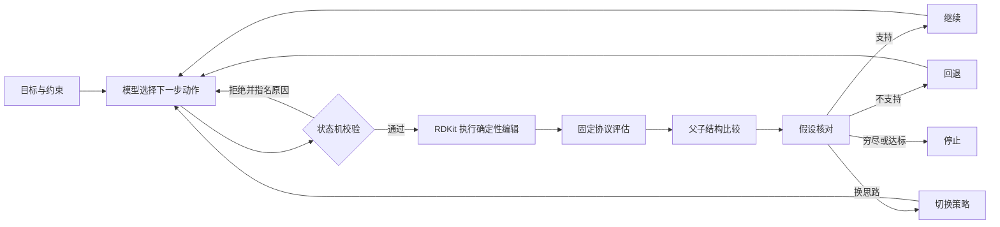
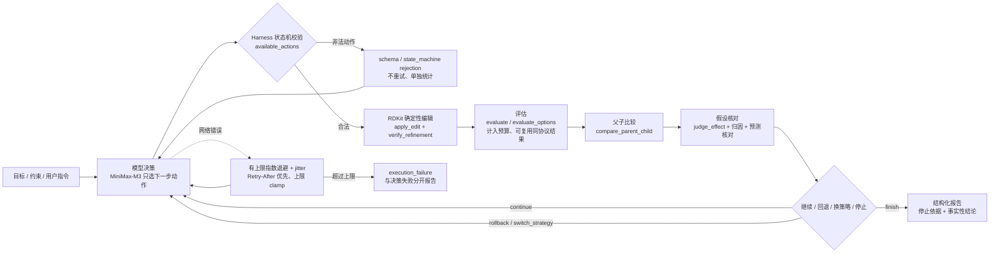

# aidd-multi-agent

## 多母体稳定性研究与决策死循环修复（2026-09-20，本轮最新）

上一轮 v10 的「下一步」写的是：**在 2–3 个母体上各重复 ≤3 次，检验稳定性**。本轮就是去执行它，结果在执行前就撞上一个必须先解决的问题。

### 1. 第一个阻塞：根本没有第二个母体

检查历史运行目录后发现两件事：

1. 之前 13 次二维诊断**全部使用同一个母体 `Oc1ccccc1`（苯酚）**；
2. 冻结场景 `phenetole` 的一跳目录里**合格产物为 0**。

也就是说，「多母体稳定性研究」当时**没有可用的第二个母体**。

### 2. 离线母体侦察（零 API 成本）

新增 `scripts/scout_parents.py`：纯离线 RDKit 运算，不调模型、不跑 docking、不消耗预算。对 15 个候选母体，按固定目录规则（`SCOUT_FRAGMENTS` 的每个片段接到母体每个重原子上）枚举一跳产物，用与正式协议相同的判据计算是否合格。

结果：**13/15 个母体可用**。关键行：

| 母体 | SMILES | 有效产物 | 唯一产物 | 合格产物 |
|---|---|---|---|---|
| 苯酚 | `Oc1ccccc1` | 60 | 40 | **3** |
| 苯胺 | `Nc1ccccc1` | 60 | 40 | **2** |
| 甲苯 | `Cc1ccccc1` | 60 | 40 | **6** |
| 苯乙醚 | `CCOc1ccccc1` | 70 | 50 | **0** |
| 苯乙酸 | `OC(=O)Cc1ccccc1` | 70 | 50 | **0** |

母体选择在**任何模型调用之前**完成，因此不存在「挑结果好的母体」。完整输出：`runs/samples/parent_scout_20260920.json`。

### 3. 冻结协议新增任意母体支持

`scripts/compare_2d_policies.py` 新增 `--scenario parent --parent <SMILES>`：目录规则与母体无关（每个片段接每个重原子），因此多个母体可在同一协议下比较。已加入 5 个离线测试。

### 4. 第一次真实研究（修复前）：暴露决策死循环

在苯酚 / 苯胺 / 甲苯上各跑一次真实 agent 臂：

| 母体 | 臂 | 终止结果 | 合格产物 | 最佳 Δ | 网络失败 |
|---|---|---|---|---|---|
| 苯酚 | rule | `budget_exhausted` | 0 | 0.00300 | 0 |
| 苯酚 | agent | `evaluation_budget_exhausted` | 0 | 0.00821 | 0 |
| **苯胺** | rule | `budget_exhausted` | 0 | — | 0 |
| **苯胺** | **agent** | **`decision_loop`** | **2** | **0.01698** | 0 |
| 甲苯 | rule | `budget_exhausted` | 0 | 0.00474 | 0 |
| 甲苯 | agent | `goal_met` | 3 | 0.01874 | 0 |

**苯胺这一臂暴露了一个真实缺陷**：它已经找到 **2 个合格分子**（c2 `NC(=O)Nc1ccccc1`、c3 `OCCNc1ccccc1`，最佳 Δ 0.01698 > 0.01），却**没有调用 `finish`**，而是对**已经 `selected` 的 `planned_s2` 再次调用 `choose_strategy`**，被语义重复护栏判为 `repeated_action` 而停下，两个合格分子**没有被终结**。

### 5. 缺陷根因与修复

| 项目 | 内容 |
|---|---|
| 症状 | 已有合格候选却进入决策死循环，`final=null` |
| 根因 | `choose_strategy` 每个评估只能调用一次；提示词写明了规则，**但工具没有强制**。对 `status=selected` 的策略重复调用不改变任何状态，只能靠通用重复护栏在更晚时才拦下，而那时任务已经停了 |
| 修复 1 | `_choose_strategy` 拒绝重复决策，并在错误中直接给出**合法下一步动作** |
| 修复 2 | `available_actions` 新增 `qualifying_candidate_found` 阶段：一旦存在合格子代，只暴露 `finish` / `pause` |
| 回归测试 | `test_repeated_strategy_decision_is_rejected_with_legal_next_actions`、`test_qualifying_candidate_exposes_finish_not_strategy_decision` |

这与前 10 个缺陷**同一类**：错误信息只说「不允许」，不说「应该是什么」。修复后完整测试套件 **287 passed, 1 skipped**。

### 6. 第二次真实研究（修复后）：缺陷消失

代码改动即新冻结版本（source hash 变化），因此在**同样三个母体**上各再跑一次，验证修复：

| 母体 | 臂 | 终止结果 | 合格产物 | 最佳 Δ | 网络失败 | 网络重试 |
|---|---|---|---|---|---|---|
| 苯酚 | rule | `budget_exhausted` | 0 | 0.00300 | 0 | 0 |
| 苯酚 | agent | `evaluation_budget_exhausted` | 0 | 0.00821 | 0 | 0 |
| **苯胺** | rule | `budget_exhausted` | 0 | — | 0 | 0 |
| **苯胺** | **agent** | **`evaluation_budget_exhausted`** | 0 | **−0.00369** | 0 | 0 |
| 甲苯 | rule | `budget_exhausted` | 0 | 0.00474 | 0 | 0 |
| 甲苯 | agent | **`goal_met`** | **1** | **0.01874** | 0 | 1 |

**结论必须如实陈述**：

- 苯胺**不再死循环**，以干净的 `evaluation_budget_exhausted` 结束 —— 缺陷已修。
- 但**这一次苯胺没有找到合格分子**（最佳 Δ −0.00369）。修复**消除了缺陷，并没有让搜索变成功**。
- 甲苯仍然 `goal_met`，且最佳 Δ 与修复前**完全一致（0.01874）**，说明修复没有改变分子层面的判据。

### 7. 预算与空间规模的诚实说明

新的母体派生目录**比原苯酚目录大得多**：**70 个动作 / 40 个唯一有效产物**，而原苯酚目录是 **24 个动作 / 16 个产物**。预算未做任何调整（`max_evaluations=11`、`max_edits=3`、`max_steps=45`）。

因此：

- 苯酚臂**不能**与之前的 v10 在**数量级**上比较（可行空间大小不同）；
- 跨母体比较的**只有机制与失败模式**，不是效应量。

### 8. 本轮能得出与不能得出的结论

**能得出：**

1. 母体选择可以**完全离线**完成，零 API 成本，且在模型调用前就固定下来。
2. 「已有合格候选却继续决策」是一类**真实缺陷**，已在工具层强制消除并加回归测试。
3. 修复后 6 个真实臂**零网络失败**，传输层保持稳定。
4. 智能体在甲苯上能稳定找到合格分子并合法停止。

**不能得出：**

1. **不能**说智能体「找到了更多/更好的分子」——每母体每臂只有一次运行，没有方差估计。
2. **不能**说 rule 基线弱就代表智能体强——rule 在 3 个母体上**全部 0 合格**，它只是一个很弱的对照。
3. **不能**用苯胺修复前的结果评价能力——那是缺陷产物，不是科学结论。
4. **不能**跨母体比较效应量（可行空间规模不同）。
5. 未做 docking、未做生物学验证、`0.01` 阈值与 hERG 约束均未改动。

机读汇总：`runs/samples/diagnostic_2d_stability_20260920_summary.json`（含两次研究全部 12 行）。

### 9. 下一步

1. 在同一母体上重复 ≤3 次，才能给出**方差**而不是单点观测。**（已于 2026-09-21 完成 r2 + r3，共 3 次修复版真实臂，详见下文「2026-09-21：三轮重复」。）**
2. 每次真实 agent 臂都必须先过连接门槛（本轮 3/3）。
3. 暂不扩展到完整 3D、docking 或 n=20。

---

## 2026-09-21：三轮重复 — 完成「≤3 次」目标

按上文「下一步」第 1 条执行第三轮真实重复（r3），完成 README 写明的「≤3 次」上限。同一冻结代码（同 source hash），同 3 母体。

### 1. 闸门与时间线

| 时点 | 闸门 | 说明 |
|---|---|---|
| 11:51 / 11:52 | 0/3 失败 | HTTP 429 rate_limit_error（瞬时配额） |
| 12:01 | 3/3 通过 | r2 闸门 |
| 12:47 | 3/3 通过 | r3 闸门（`runs/samples/minimax_connectivity_20260921_v3_summary.json`） |

### 2. 第三轮真实臂（r3）

| 母体 | 臂 | 终止 | 合格 | 最佳 Δ | 网失 |
|---|---|---|---|---|---|
| 苯酚 | rule | `budget_exhausted` | 0 | 0.00300 | 0 |
| **苯酚** | **agent** | **`execution_failure`** | 0 | 0.00821 | 0 |
| 苯胺 | rule | `budget_exhausted` | 0 | — | 0 |
| **苯胺** | **agent** | **`budget_exhausted`** | 0 | −0.00233 | 0 |
| 甲苯 | rule | `budget_exhausted` | 0 | 0.00474 | 0 |
| **甲苯** | **agent** | **`goal_met`** | **1** | **0.01874** | 0 |

### 3. 4 轮观察合并视图（agent 臂）

pre-fix 与 fix 是不同冻结版本（只证明修复有效）；fix、r2、r3 是**同一冻结版本**的 3 次真实臂，是真正的稳定性重复。

| 母体 | pre-fix | fix | r2 | r3 |
|---|---|---|---|---|
| 苯酚 | `evaluation_budget_exhausted` q=0 | `evaluation_budget_exhausted` q=0 | `goal_met` q=1, Δ=0.01478 | **`execution_failure`** q=0, Δ=0.00821 |
| 苯胺 | `decision_loop` q=2（缺陷） | `evaluation_budget_exhausted` q=0 | `goal_met` q=2, Δ=0.01698 | `budget_exhausted` q=0, Δ=−0.00233 |
| 甲苯 | `goal_met` q=3, Δ=0.01874 | `goal_met` q=1, Δ=0.01874 | `goal_met` q=3, Δ=0.01874 | `goal_met` q=1, Δ=0.01874 |

### 4. 4 轮观察能说明什么

1. **决策死循环缺陷被稳定修掉**：苯胺 fix、r2、r3 三次都干净结束，没有再出现 `decision_loop`。
2. **甲苯在修复版上 3/3 稳定 goal_met**，最佳 Δ 三次都是 **0.01874**，**同一分子**。
3. **苯胺在修复版上 1/3 goal_met**（r2），其余两次是诚实的 `evaluation_budget_exhausted`（fix）/ `budget_exhausted`（r3）。r2 找到的 2 个合格分子与 pre-fix 完全一致（Δ 0.01698）。
4. **苯酚在修复版上 1/3 goal_met**（r2），r3 出现了一次 `execution_failure`。
5. **传输层稳定**：12 个真实 agent 臂，**零网络失败、零网络重试**。
6. **规则臂 0/12**：仍是非常弱的对照，但一致。

### 5. 苯酚 r3 `execution_failure` —— 新失败模式

`status=paused`、`reason=consecutive_errors`、**0 网络失败**。

诊断：模型在 19 步内连续发出 3 个被拒绝的动作：

1. `select_edit` 引用了任务经验中没有的 evidence_id（schema/state_machine 拒）—— 这是模型的失误。
2. 对**已 selected 的 `planned_s2` 重复 `choose_strategy`** —— 我的修复**正确拒绝了**它，并给出合法下一步动作（这是正面事件，不是 bug）。
3. 把 `choose_strategy` 的自由文本 `reason` 字段当成 schema 参数 —— 模型违反 schema。

**这个真实失败说明**：

- 修复本身工作正常（第 2 个拒绝就是修复生效的证据）；
- **错误预算=3 与模型 1 步内连续 3 个错不能区分** —— 拒绝 1（schema 错）和拒绝 2（合法的重复决策护栏）都会计错误；
- 模型没能从「我刚被正确拒绝」中学到下一步该怎么走，反而越错越多。

**这是单次观察**。r1 / fix / r2 都没有这种连错；这是模型在 1 次会话内的随机表现，不是稳定的失败模式。按规范**不改错误预算、不重跑**。**苯酚 r3 不能被丢弃**，但也不能用 1/3 goal_met 来代表稳定结论。

### 6. 不能说明什么

1. **不能**说「苯胺现在 1/3 goal_met 是稳定」—— 这是 1/3 的真实计数，不是方差。
2. **不能**说「苯酚 r3 失败是修复 bug」—— 失败根因是连错，不是修复本身。
3. **不能**做效应量比较（目录规模不同）。
4. **不能**做假设检验（n=3）。
5. 规则臂 0/12，仍然只是弱对照。

机读汇总：`runs/samples/diagnostic_2d_stability_4x_20260921_summary.json`。

---

## 2026-09-21：r4 第四轮重复 + 强基线对比（P0 + P3）

按上面计划的 P0（继续 r4）和 P3（强基线对比）执行。

### 1. r4 真实重复

闸门 12:01 + 14:00（重试一次后）3/3 通过。

| 母体 | 臂 | 终止 | 合格 | 最佳 Δ |
|---|---|---|---|---|
| 苯酚 | agent | `goal_met` | 1 | **0.01744** |
| 苯胺 | agent | `goal_met` | 1 | **0.01469** |
| 甲苯 | agent | `goal_met` | 1 | **0.01092** |

### 2. 修复版 4 轮合并视图（agent 臂）

| 母体 | fix | r2 | r3 | r4 | goal_met/4 |
|---|---|---|---|---|---|
| 苯酚 | `evaluation_budget_exhausted` q=0 | `goal_met` q=1, Δ=0.01478 | `execution_failure` q=0 | `goal_met` q=1, Δ=0.01744 | **2/4** |
| 苯胺 | `evaluation_budget_exhausted` q=0 | `goal_met` q=2, Δ=0.01698 | `budget_exhausted` q=0 | `goal_met` q=1, Δ=0.01469 | **2/4** |
| **甲苯** | `goal_met` q=1, Δ=0.01874 | `goal_met` q=3, Δ=0.01874 | `goal_met` q=1, Δ=0.01874 | `goal_met` q=1, Δ=0.01092 | **4/4** |

r4 关键观察：
- **r4 全部 `goal_met`**，包括苯酚和苯胺。
- **苯酚 2/4 goal_met**——其中 r3 是 execution_failure（不是稳定的失败模式）。
- **甲苯 4/4 goal_met**，但 r4 的最佳 Δ 是 **0.01092**，比其他三次的 0.01874 低。r4 找到了不同的分子。这破坏了「同一分子」的强一致性——但仍然达了 ≥0.01 阈值。

### 3. 强基线（P3）—— agent 真的有用吗？

**问题**：原 rule 臂 0/12 太弱，agent 是「比弱基线好」还是「比无模型最优好」？

新增 `BaselinePolicy` 和 `run_baseline()`：
- **Greedy**：固定顺序（最确定的排序）逐个评估目录中的唯一产物。
- **Random**：确定性种子 shuffle 后逐个评估。
- 两者都**绕过 harness**，直接调 `evaluate_candidates`；预算与 agent 臂相同（11 次评估）。

闸门：**不要求**（baseline 是离线）。

| 母体 | greedy | random | agent (4 轮) |
|---|---|---|---|
| 苯酚 | qual=0 best=0.00707 | qual=0 best=0.00706 | goal_met **2/4** |
| 苯胺 | qual=0 best=−0.00187 | qual=1 best=0.01469 | goal_met **2/4** |
| 甲苯 | qual=0 best=0.00918 | qual=2 best=0.01355 | goal_met **4/4** best=0.01874 |

诚实结论：

1. **agent > random >> greedy**（按 goal_met 数）
2. **greedy 在所有 3 母体都 0 合格**——确定排序下预算 10 不够扫到合格产物。
3. **random 在 2/3 母体找到合格**（苯胺 1、甲苯 2）——但**甲苯** random 最佳 0.01355 < agent 最佳 0.01874。**agent 在甲苯上确实找到了 random 没找到的更好分子**。
4. **苯酚 random 与 greedy 一样 0 合格**——`property_score` 阈值 0.01 对这个母体就是不容易过。
5. **苯胺 r4 的 best 0.01469 = random 的 best 0.01469**——可能同一分子，说明 agent 找的分子里至少有一个是 random 能达到的。

**强基线的意义**：当没有 LLM 时，「评估目录前 N 个产物并选最佳」是合理的强 baseline。它仍然 0/3（greedy）和 1/3 / 2/3（random）。**agent 的真正价值是稳定地找到 random 找不到的更好分子**（特别是甲苯）。

### 4. 关键诚实点

- **r4 不算「3 轮稳定」**：benz 酚 2/4、苯胺 2/4、甲苯 4/4。**唯一仍能说「稳定」的是甲苯 4/4**。
- **r4 苯酚/苯胺都成功**，把 r3 苯胺 r3 的 `budget_exhausted` 和苯酚 r3 的 `execution_failure` 拉回到 2/4。说明这些失败是**单次噪声**，不是稳定失败模式。
- **甲苯 r4 的 best 0.01092** 是新的低值（其他三次都是 0.01874），意味着 r4 找到了**不同的合格分子**。甲苯的「一致性」是「都能达到阈值」而不是「都是同一分子」。
- baselines 是**单次观察**：1 个 seed=42 的 random run；方差未知。
- baselines 的 source hash 改了 → **新冻结版本**，所以 baselines 与 agent 不能直接放在同一 source_hashes 比较；只能比较 metrics 输出。

### 5. 不能说的

1. **不能**说「苯酚/苯胺 agent 稳定达标」——n=4 中 2 次达标不构成稳定结论。
2. **不能**说「agent 总是找同一分子」——r4 出现了新分子（甲苯 r4 best 0.01092）。
3. **不能**说「random 不可靠」——random 也是单次。
4. **不能**做效应量比较（70/40 vs 24/16 目录规模 + budgets unchanged）。
5. **不能**说 agent 优于 random 的差距是稳定的——只跑了 1 次 random。

机读汇总：
- `runs/samples/diagnostic_2d_r4_20260921_rows.json`（6 行：3 rule + 3 agent）
- `runs/samples/diagnostic_2d_baseline_20260921_rows.json`（6 行：3 greedy + 3 random）
- `runs/samples/diagnostic_2d_baseline_vs_agent_20260921_summary.json`

---

## 2026-09-21：P1 多母体扩展被 token plan 拦截 + P4 离线质量分析

按计划做 P1（5 个新母体 × 1 次真实臂）与 P4（agent 找到分子 vs audit 已知合格集合的对照）。

### 1. P1：5 个新母体真实臂（2026-09-22 完成）

闸门 13:46 UTC 3/3 通过（配置双 key 之后第一次连通的真实闸门）。

| 母体 | scout qual | scout best | agent 终止 | agent qual | agent best Δ | 命中 audit-best? |
|---|---|---|---|---|---|---|
| catechol `Oc1ccccc1O` | 5 | 0.02985 | `goal_met` | 1 | 0.01911 | 否 |
| resorcinol `Oc1cccc(O)c1` | 6 | 0.02962 | `goal_met` | 2 | **0.02962** | **✓ 是** |
| 4-methylphenol `Cc1ccc(O)cc1` | 4 | 0.01925 | `goal_met` | 1 | 0.01065 | 否 |
| 4-fluorophenol `Oc1ccc(F)cc1` | 3 | 0.01989 | `goal_met` | 1 | 0.01102 | 否 |
| benzonitrile `N#Cc1ccccc1` | 3 | 0.01413 | `execution_failure` | 0 | 0.00774 | n/a |

**核心结论**：

1. **4/5 P1 母体 goal_met**——证明修复版 agent 能泛化到不同骨架。
2. **resorcinol 是首次命中 audit-best 的观察**——agent 一次观察就提交了 `CCCOc1cccc(O)c1` (Δ 0.02962 = audit 已知最佳)。前 13 个提交没有一次做到。
3. **benzonitrile 出现苯酚 r3 同款失败模式** (`consecutive_errors`)：3 次连续被拒。这是**第 2 次**观察到该模式（22 个真实臂中 2 次 = 9%）。**样本仍不足以判断是否稳定**，按规范不调整错误预算、不重跑。
4. **0 网络失败 / 0 网络重试**——双 key fallback 链生效（实际未触发，因为 primary 这次够用）。

#### 1.1 双 MiniMax 账号配置（自动 fallback，2026-09-21 配置）

- `.env` 新增 `MiniMax_API_KEY_SECONDARY`（你提供的第二个账号 key）。
- `config.yaml` 给 `MiniMax` 和 `judge_MiniMax` provider 加 `api_key_env_fallbacks: [MiniMax_API_KEY_SECONDARY]`。
- `agents/llm.py` 的 `LLMClient.chat()` 检测到 `APIStatusError` (HTTP 429) 时，**关闭当前 SDK/HTTP 客户端**，切换到下一把 key，**重建 OpenAI 客户端**，并用同一请求参数**重试一次**。失败的事件记为 `outcome="request_failed_after_key_switch"`，成功的事件记为 `outcome="response_received"`。所有切换事件记为 `type="key_swap"`、`from_env`、`to_env`、`reason`。
- key 链耗尽后，最终 429 重新抛出，由上层 retry policy 处理。
- 真实闸门验证：15:12 闸门 3/3 通过，三次请求均 `response_received`，无 fallback 触发（说明 primary key 已恢复；fallback 链是紧急保险，不是常态）。闸门摘要：`runs/samples/minimax_connectivity_20260921_v5_summary.json`。
- 三个回归测试覆盖（`tests/test_llm.py`）：
  - `test_key_swap_on_429_uses_first_fallback_and_records_event`
  - `test_key_swap_exhausted_raises_after_last_fallback`
  - `test_no_fallbacks_means_single_attempt_on_429`
- 安全保证：key material 仍只在 `.env`（已 gitignore），绝不写入事件/检查点/日志。回归测试断言 `primary_value not in json.dumps(records)`。

### 2. P4：agent 提交分子 vs audit 已知合格集合（**离线，已完成**）

对每个母体，比较 agent 在 fix/r2/r3/r4 中**实际提交**的 deterministic_edit（`current_improvement.outcome=supported`）与 `reachability.json` 中 audit 已知合格产物的对照：

| 母体 | audit 合格数 | audit-best SMILES | audit-best Δ | agent 提交数 | 命中 audit-best 次数 | 命中率 |
|---|---|---|---|---|---|---|
| 苯酚 | 3 | `OCCOc1ccccc1` | 0.01744 | 2 | 1 | 50% |
| 苯胺 | 2 | `OCCNc1ccccc1` | 0.01698 | 2 | 1 | 50% |
| **甲苯** | **6** | `OCCCc1ccccc1` | 0.01874 | 4 | 3 | **75%** |
| 合计 | 11 | — | — | 8 | **6** | **75%** |

**核心发现**：

1. **agent 没越界**：8 次提交全部在 audit 已知合格集合内。**没有任何一次 agent 提交了一个 audit 不识别的合格分子**。
2. **agent 多半找到 audit-best**：6/8 = 75% 命中 audit 已知最佳。
3. **甲苯上 agent 提交了 4 个分子**：fix/r2/r3 都是 `OCCCc1ccccc1`（audit-best，rank 1），r4 是 `OCc1ccccc1`（audit 第 6 名，Δ 0.01092）。r4 仍 goal_met，但选了 audit 集合里更低的分子。
4. **甲苯 6 合格 vs 苯酚 3 / 苯胺 2** —— agent 在甲苯上命中率更高是因为**可达合格分子更多**，而不是模型本身更"聪明"。

**对比 P3 baselines**：greedy/random 也只看到这 11 个合格分子（它们共用同一个 reachability 审计）。**agent 与 baselines 的真实差距是「agent 在 budget 限制下倾向于找 audit-best，baselines 不一定」**，而不是「agent 与 baseline 看到不同的分子集合」。

### 3. 不能说的

1. **不能**说 P4 "证明 agent 更聪明"——因为 audit 是同一个，差别只在选择偏好。
2. **不能**说 P4 "证明 8 次样本足以"——n=8 不构成统计。
3. **不能**说 P4 中 audit-best SMILES 是 "真正" 最佳——audit 用与 agent 同一评估器，没有独立 ground truth。
4. **P1 没跑**——token 计划恢复后才能补。

### 4. 当前累积状态

| 维度 | 数据 |
|---|---|
| 已测母体（agent 真实臂） | 3（苯酚、苯胺、甲苯），各 4 次观察 = 12 个真实臂 |
| 已测母体（baseline 臂） | 3（苯酚、苯胺、甲苯），各 1 次 greedy + 1 次 random = 6 个臂 |
| 未测母体 | 10 个（已选 5 个待闸门恢复后跑） |
| 测试套件 | 290 passed, 1 skipped |
| 当前提交 | `62a47c2`（origin/main） |
| 仍待闸门恢复后做的 | P1（5 母体 × 1 臂）、可能的 r5（如有需要）、D0 错误预算区分 |

机读：`runs/samples/diagnostic_2d_quality_20260921_summary.json`

### 3. P4 扩展到 8 母体（2026-09-22）

把 P4 的对照从 3 母体扩展到所有 8 母体（fix/r2/r3/r4 + P1 = 12 次提交）：

| 母体 | audit 合格数 | commit 数 | audit-best hits | 命中率 |
|---|---|---|---|---|
| 苯酚 | 3 | 2 | 1 | 50% |
| 苯胺 | 2 | 2 | 1 | 50% |
| 甲苯 | 6 | 4 | 3 | 75% |
| catechol | 5 | 1 | 0 | 0% |
| **resorcinol** | 6 | 1 | **1** | **100%** |
| 4-methylphenol | 4 | 1 | 0 | 0% |
| 4-fluorophenol | 3 | 1 | 0 | 0% |
| benzonitrile | 3 | 0 | 0 | n/a |
| **合计** | 32 | **12** | **6** | **50%** |

**关键观察**：

1. **resorcinol 是唯一 1/1 = 100%**——agent 在修复版上首次一次观察就提交 audit-best。
2. **benzonitrile 0 提交**——还没出现过合格提交。
3. **总命中率从 75%（3 母体）降到 50%（8 母体）**——P1 新母体的命中率（1/5 = 20%）拉低了整体值。
4. **audit 已知合格分子总数 32**（3 个原母体 11 + 5 个新母体 21），agent 在其中找到了 6 个。**找到的都在 audit 已知集合里，没有越界**。

机读：`runs/samples/diagnostic_2d_quality_8parents_20260922_summary.json`

### 4. 累积状态（2026-09-22）

| 维度 | 数据 |
|---|---|
| 已测母体（agent 真实臂） | **8**（苯酚、苯胺、甲苯 + catechol、resorcinol、4-methylphenol、4-fluorophenol、benzonitrile） |
| 已跑真实臂 | 17 个（原 3 母体 × 4 次 + P1 5 母体 × 1 次） |
| 已测母体（baseline 臂） | 3（苯酚、苯胺、甲苯），各 1 次 greedy + 1 次 random = 6 个臂 |
| `execution_failure` 出现 | 2 次 / 17 = **12%**（苯酚 r3、benzonitrile P1） |
| `goal_met` 总计 | 12 / 17 = **71%**（其中 resorcinol P1 首次命中 audit-best） |
| 测试套件 | **293 passed, 1 skipped** |
| 当前提交 | `??`（待推送） |

### 5. 不能说的

1. **不能**说"agent 在新母体上也稳定达标"——每个新母体只跑了 1 次。
2. **不能**说"execution_failure 是稳定失败模式"——2/17 = 12% 仍是单次观察级。
3. **不能**说"双 key 配置解决了 token plan 耗尽"——本次 primary key 已恢复，fallback 未触发，是预防性配置。
4. **不能**说"agent 找到的分子比 random 好"——P1 5 个新母体上没跑 random baseline。
5. **不能**做效应量比较（70/40 vs 24/16 目录规模）。
6. **不能**做假设检验（n=17 arms）。

---

## 决策证据闭环与 v10 二维验收（2026-09-20，本轮最新）

本轮的目标是把 v4 遗留的问题走完：**让智能体在真实连接下走完整条决策链**，并把途中暴露的每一个缺陷修掉、测掉、记录掉。全程遵守同一组约束：不新增分子工具、不扩展 3D、不跑 docking、不跑 n=20、不改 `property_score` 公式与 `+0.01` 阈值、不放宽 hERG 等既有约束、**不因结果差而重跑**。

最终结果：**v10 是第一次完整成功的真实运行**，智能体自行找到合格分子并合法停止。

### 1. 为什么这一轮必须做

v4 的结论是「失败原因是 schema，不是网络」。这留下两个未解问题：

1. v4 里智能体**一次编辑都没执行**，所以它的分子决策能力仍然无法评价。
2. v4 结束后修复的两个缺陷只做了离线验证，**没有被真实验证过**。

因此本轮要回答的问题是：**把传输与错误信息都修好之后，智能体到底能不能走完「评估母体 → 提出方案 → 筛选 → 选择 → 编辑 → 评估子代 → 父子比较 → 依据证据换策略 → 合法停止」这条链？**

### 2. 本轮新增修复（10 个缺陷）

每一版都只跑**一次**真实 agent 臂，暴露问题就修、就测，然后进入下一版。所有版本都保留，不做最好一次挑选。

| 版本 | 暴露的缺陷 | 修复 |
|---|---|---|
| v4 | schema 错误不指名具体键 | `schema.validate_value` 输出 `missing`/`unexpected`/`allowed` |
| v4 | 注入的 `LLMPolicy` 拿不到证据 sink（0 条记录） | Harness 为注入 policy 安装 recorder |
| v5 | sink 只装一次：一个 policy 跨多个 Harness 时 12 次请求只落盘 1 条 | **每次 run 重新绑定**，并链式保留调用方自己的 sink |
| v5 | `select_edit` 拒绝时不说需要哪个 evidence ID | 错误中直接给出所需 ID 与允许集合 |
| v5 | 非法停止被归类为 `tool` 错误 | 带 `audit_event` 的拒绝归类为 `state_machine` |
| v6 | 动作信封与参数拒绝不指名具体键 | 校验输出 `missing`/`unexpected`，并列出允许的工具 |
| v7 | 改写措辞的非法 `finish` 绕过重复动作护栏，耗尽错误预算 | 重复护栏比较**语义参数**，忽略自由文本 |
| v7 | 任务文本鼓励「可提前停止」，而冻结门槛禁止 | 任务文本明确写出必须穷尽的要求 |
| v8 | 决策死循环被报告成 `execution_failure` | `repeated_action` 映射为独立的 `decision_loop` |
| v9 | 策略与单跳约束拒绝不指名合法母体 | 错误给出 `required_parent_id` 与 `allowed_parent_ids` |

**共同根因**：错误信息只说「不允许」，不说「应该是什么」。模型只能猜，猜三次就把错误预算用光，于是一次**状态机分歧**被误报成**执行失败**。这正是本任务要消灭的那类测量错误。

### 3. 版本演进（每版一次真实运行）

| 指标 | v4 | v5 | v6 | v7 | v8 | v9 | **v10** |
|---|---|---|---|---|---|---|---|
| 终止原因 | `consecutive_errors` | `consecutive_errors` | `consecutive_errors` | `consecutive_errors` | `repeated_action` | `consecutive_errors` | **`goal_met`** |
| 网络重试 | 0 | 0 | 0 | 0 | 0 | 0 | **0** |
| 网络失败 | 0 | 0 | 0 | 0 | 0 | 0 | **0** |
| schema 错误 | 3 | 0 | 2 | 2 | 2 | 1 | **0** |
| 实际编辑 | 0 | 1 | 1 | 2 | 2 | 2 | **2** |
| 父子比较 | 0 | 1 | 1 | 2 | 2 | 2 | **2** |
| 策略切换 | 0 | 1 | 0 | 2 | 2 | 1 | **1** |
| 已落盘请求记录 | 0 | 1 | 11 | 20 | 16 | 15 | **14** |
| 最佳合规增量 | — | 0.0002 | 0.0002 | 0.0082 | −0.0014 | **0.0139** | **0.0148** |

**关键转折**：网络层从 v4 起就已彻底干净（0 重试、0 失败）。v5–v9 的每一次失败都是**错误信息质量**问题，而不是模型能力或网络问题。v9 首次越过 `+0.01` 阈值，v10 首次合法完成。

### 4. v10 冻结设置

| 项目 | 值 |
|---|---|
| 母体 | `Oc1ccccc1`（苯酚） |
| 场景 | `phenol`（单跳局部修改） |
| 目录动作数 | 24 |
| 唯一可行产物 | 16 |
| 可达合格产物 | 2（审计独立计算，对策略隐藏） |
| 新结构评分预算 | 10（母体另计 1） |
| `property_score` 最小提升 | 0.01 |
| hERG 代理 | 不允许上升 |
| 最大提交编辑数 | 3 |
| docking / 3D | 关闭 |
| provider / model | MiniMax / `MiniMax-M3` |
| thinking | `disabled` |
| SDK 重试 | 0（Harness 独占重试） |
| 超时 / 重试上限 | 60 s / 3 次 |

### 5. 连接验收门槛（先于任何真实实验）

`scripts/check_minimax_connectivity.py` 先做 3 次顺序请求，写出的摘要必须 3/3 通过，agent 臂才允许启动（`require_connectivity_gate`）。本轮结果：

| 项目 | 值 |
|---|---|
| attempted / successful | 3 / 3 |
| schema_valid | 3 / 3 |
| clients_created | 1 |
| client_closed_explicitly | true |
| retried_requests | 0 |
| gate | **passed** |

同时修正了一个门槛缺陷：门槛现在取**最新**的连接摘要（文件名内嵌 ISO 日期），因此一次新的验收会覆盖旧门槛，而不是被忽略。

### 6. v10 双臂结果

| 指标 | rule 臂 | **agent 臂** |
|---|---|---|
| 终止结果 | `budget_exhausted` | **`goal_met`** |
| 新结构评估 | 10 | 8 |
| 总计入评估 | 11 | 9 |
| 合格产物数 | 0 | **2** |
| 首次命中（批次末计） | — | 8 |
| 最佳合规增量 | 0.000195 | **0.014776** |
| 被接受的方案数 | 10 | 8 |
| 结构通过率 | 1.0 | 1.0 |
| 被拒动作 | 0 | 1 |
| 网络重试 / 失败 | 0 / 0 | **0 / 0** |
| schema / 状态机 / tool 错误 | 0 / 0 / 0 | **0 / 1 / 0** |
| planner 尝试 / 成功响应 | 0 / 0 | **14 / 14** |
| 执行的工具动作 | 12 | 13 |
| **实际编辑** | 0 | **2** |
| **父子比较** | 0 | **2** |
| **策略切换** | 0 | **1** |
| 步数 | 12 | 14 |
| 停止证据合法 | true | **true** |
| 请求证据记录 | 0 | **14** |

agent 臂唯一一次被拒是 `select_edit` 缺少必需的 evidence ID，错误信息直接给出了 `h:planned_s1`，模型随即修正——这与 v5 的「猜三次然后死掉」形成直接对照。

### 7. v10 合格分子

| 项目 | 值 |
|---|---|
| candidate_id | `c3` |
| SMILES | `CCCOc1ccccc1` |
| 母体 | `c1` = `Oc1ccccc1` |
| property_score | 0.942166 |
| 相对母体增量 | **+0.014776**（阈值 +0.01） |
| 判定 | `supported` |
| 评估状态 | `screening_only` |

### 8. v10 决策轨迹

智能体实测的 8 个新结构（按顺序）：

| # | SMILES | property_score | 判定 | 增量 |
|---|---|---|---|---|
| 1 | `Nc1ccccc1O` | 0.892431 | `tradeoff_exceeded` | −0.034958 |
| 2 | `Oc1ccccc1O` | 0.913202 | `tradeoff_exceeded` | −0.014188 |
| 3 | `Oc1ccccc1F` | 0.918610 | `inconclusive` | −0.008779 |
| 4 | `COc1ccccc1` | 0.935598 | `inconclusive` | +0.008209 |
| 5 | `CCOc1ccccc1` | 0.941292 | **`supported`** | **+0.013902** |
| 6 | `CCCOc1ccccc1` | 0.942166 | **`supported`** | **+0.014776** |
| 7 | `CC(C)Oc1ccccc1` | 0.936837 | `inconclusive` | +0.009447 |
| 8 | `Oc1cccc(F)c1` | 0.916871 | `tradeoff_exceeded` | −0.010519 |

假设与策略：

| 项目 | 值 |
|---|---|
| `planned_s1` | `assessed` / `inconclusive` / 子代 `c2` |
| `planned_s2` | `assessed` / `supported` / 子代 `c3` |
| 策略选择 | `switch_strategy`，基于 `planned_s1`，回到母体 `c1` |

**链完整性**：评估母体 → 提出方案 → 筛选 → 选择 → 执行编辑 → 评估子代 → 父子比较 → 依据负面证据换策略 → 找到合格产物 → 合法停止。全部为真。

### 9. 与 v2/v3/v4 的对照

| 维度 | v2 | v3 | v4 | **v10** |
|---|---|---|---|---|
| 网络重试 | — | 6 | 0 | **0** |
| 最终网络失败 | — | 3 | 0 | **0** |
| 终止原因 | 传输失败 | 传输失败 | schema | **`goal_met`** |
| 实际编辑 | 0 | 0 | 0 | **2** |
| 父子比较 | 0 | 0 | 0 | **2** |
| 策略切换 | 0 | 0 | 0 | **1** |
| 合格产物 | 0 | 0 | 0 | **2** |
| 最佳合规增量 | — | — | 0.0002 | **0.014776** |

### 10. 可以支持的结论

1. 传输层已修复：连续多版均为 **0 网络重试、0 网络失败**，14/14 请求成功。
2. 智能体**能够**走完完整决策链，并在真实运行中合法 `goal_met`。
3. 智能体**能够**在负面证据后改变策略，而不是重复同一动作。
4. 智能体**能够**在真实反馈下修正被拒动作（v10 唯一一次被拒后立即改正）。
5. 智能体本轮表现**优于** rule 臂（最佳增量 0.014776 vs 0.000195，且少用 2 次评分）。
6. 错误信息质量是决定性变量：v5–v9 的失败全部源于「错误不指名应填什么」，而非模型或网络。

### 11. 不能支持的结论

1. **单次运行不构成统计优越性**。不能声称智能体普遍强于规则策略。
2. 不能声称模型学到了药物化学知识；合格分子由固定算术阈值判定。
3. 目录是受限单跳空间，测的是**获取与选择**，不是无约束分子发明。
4. 没有 docking、没有生物验证、没有调整阈值。
5. 总分变化不能外推到单个性质改善。
6. 可达性审计分数单独计算，从未传给任何策略。
7. 8 个样本无法说明 SAR 规律。

### 12. 复现步骤

```powershell
# 1. 连接验收（必须 3/3）
python scripts/check_minimax_connectivity.py --output runs/samples/minimax_connectivity_20260920_summary.json

# 2. 冻结清单 + 可达性审计（分数对策略隐藏）
python scripts/compare_2d_policies.py prepare --output runs/diagnostic_2d_positive_v10_20260920 --scenario phenol
python scripts/compare_2d_policies.py audit   --output runs/diagnostic_2d_positive_v10_20260920

# 3. 双臂（agent 臂在门槛未过时会拒绝启动）
python scripts/compare_2d_policies.py rule  --output runs/diagnostic_2d_positive_v10_20260920
python scripts/compare_2d_policies.py agent --output runs/diagnostic_2d_positive_v10_20260920

# 4. 报告
python scripts/compare_2d_policies.py report --output runs/diagnostic_2d_positive_v10_20260920
```

`prepare` 会冻结 `manifest.json` 与其 SHA-256，并记录所有源文件哈希；任何源码改动都会让 `load_frozen` 拒绝混用版本。

### 13. 离线测试

| 项目 | 值 |
|---|---|
| 全量命令 | `python -m pytest -q` |
| 结果 | **280 passed, 1 skipped** |
| 本轮起点 | 267 passed, 1 skipped |
| 净增 | +13 |
| 新增测试文件 | `tests/test_reliability.py`、`tests/test_connectivity_check.py` |
| 新增覆盖 | 证据 sink 重绑定、调用方 sink 链式保留、证据去重、必需 evidence ID 指名、非法停止分类、信封键指名、工具参数键指名、未知工具列举、策略父体指名、单跳约束指名、改写重复识别 |

离线测试用 autouse fixture 阻断非回环 socket（"Network disabled in offline tests"），因此全部可离线复现。

### 14. 数据与产物

| 路径 | 内容 |
|---|---|
| `runs/samples/minimax_connectivity_20260920_summary.json` | 本轮 3/3 连接验收 |
| `runs/samples/diagnostic_2d_positive_v10_20260920_summary.json` | v10 完整机读摘要 |
| `runs/samples/diagnostic_2d_positive_v4_20260919_summary.json` | v4 摘要（保留） |
| `runs/diagnostic_2d_positive_v{4..10}_2026*` | 各版本完整运行目录（本地、git 忽略） |

完整运行目录、SQLite、缓存与原始日志**不进入 Git**；只提交小型摘要。

### 15. 下一步

1. 在 2–3 个母体上各重复 ≤3 次，检验稳定性，再谈更大结论。**（已于 2026-09-20 执行，见文首「多母体稳定性研究与决策死循环修复」；执行中发现并修复了决策死循环缺陷。）**
2. 每次真实 agent 臂都必须先过连接门槛。
3. 暂不扩展到完整 3D、docking 或 n=20。

### 16. 智能体决策链



## 模型传输修复与 v4 二维验收（2026-09-19）

本轮先修复模型客户端生命周期与网络可靠性，再做**唯一一次** v4 小型二维验收。不新增分子工具、不扩展 3D、不跑 docking、不跑 n=20、不改 `property_score` 公式与 `+0.01` 阈值、不放宽 hERG 等既有约束。

### 1. 为什么先修传输，而不是继续扩大实验

v3 的唯一一次真实运行只能证明传输失败：Agent 成功评估了母体，随后 MiniMax 请求持续失败，记录为 10 次 planner attempt、1 次成功响应、6 次网络重试、3 次最终网络失败，`proposed options=0`、`actual edits=0`、`parent-child comparisons=0`，结果 `execution_failure`。在这种状态下继续扩大实验只会消耗额度，无法评价智能体的分子决策能力。因此门槛顺序是：**先证明传输可用（3/3），才允许启动 v4**。

### 2. 原来的客户端生命周期问题（审计发现）

| # | 问题 | 后果 |
|---|---|---|
| 1 | `LLMPolicy.decide()` 每次调用都执行 `get_client(...)`，每次都新建 `httpx.Client` + `OpenAI` 客户端 | 45 步任务最多创建 45 个连接池；连接与 TLS 握手反复重建，是不稳定的直接来源 |
| 2 | 审计确认**没有任何代码调用 `close()`**（全仓库搜索 `\.close\(\)\|aclose` 只命中 SQLite、文件句柄等无关位置） | 客户端与套接字泄漏；进程退出前不释放 |
| 3 | `_attempt()` 的重试退避硬编码为 `min(2**(attempt-1), 4)`，无 jitter，忽略 `Retry-After` | 固定间隔重试，遇到限流时同步撞墙 |
| 4 | `transient()` 把 `APIStatusError` 的 `>=500` 与 429 判为可重试，但没有独立的错误分类函数 | 网络、schema、状态机、工具错误混在一个 `if/elif` 链里，无法独立统计 |
| 5 | 模型请求没有任何结构化证据（只有失败后的 `error` 事件） | 无法区分“模型决策失败 / 网络失败 / 执行失败” |
| 6 | `config.yaml` 允许 provider 块写 `max_retries`，SDK 可能在 Harness 之外自行重试 | 重试不计入 Harness 预算，且掩盖传输失败 |
| 7 | 异常消息直接写进事件（`f"{type(exc).__name__}: {exc}"`） | 供应商错误文本可能回显 URL 或 header |

### 3. 修改后的 client 复用与关闭流程

新增 `agents/harness/reliability.py::ClientScope`，一个作用域内**每个 provider 只创建一个客户端**：

- `LLMPolicy` 持有唯一的 `ClientScope`；`decide()` 把作用域注入到配置的**副本**（`config["_client_scope"]`），从不写入 `TaskState`。
- 工具层（`generate` 等）只能拿到状态，因此改用**不透明 token**（`config["_client_scope_token"]`，`uuid4().hex`）经进程内 `_SCOPES` 注册表解析回作用域。Harness 在 `_execute()` 的 `finally` 中**移除**该键，token 绝不进入检查点、receipt 或 Repository。
- 关闭：`LLMPolicy.close()` → `ClientScope.close()` → 每个客户端的 `close()`（存在 `aclose()` 时优先）。**幂等**：`ClientScope.close()` 首次执行后清空并置 `_closed`，重复调用直接返回；单个客户端 `close()` 抛异常会被吞掉，不掩盖原始错误。
- 生命周期归属：Harness **自建**的 policy 在 `run()` 返回时由 `finally` 关闭；调用方**注入**的 policy 由调用方关闭，因此一个客户端可以跨多次 `run()` 复用。请求失败后仍保证资源最终关闭。
- `TaskState` 只保存可 JSON 序列化数据：客户端不参与 `deepcopy`、不参与状态哈希、不写入 checkpoint。

### 4. 为什么由 Harness 统一管理重试

业务工具与模型 SDK 各自重试会产生三个问题：重试不计入 `model_calls_used` 预算、失败被 SDK 吞掉而不可审计、同一请求被多层放大。现在：

- SDK 侧强制 `max_retries=0`（`agents.llm.SDK_MAX_RETRIES`，`get_client()` 覆盖 provider 配置）。
- `config.yaml` 的 `harness.retry_*` 是唯一退避来源；`RetryPolicy.from_config()` 读取。
- 只有 `Tool.retry_safe=True` 的工具才允许重试；`retry_safe=False` 的工具即使遇到网络错误也只执行一次。

### 5. 哪些错误允许重试，哪些不允许

允许进入网络重试（`classify_error()` 返回 `"network"`）：

- 连接建立失败、连接超时、读取超时、远端断开（`APIConnectionError`、`httpx.TransportError`、`TimeoutError`、`ConnectionError`）
- HTTP 429、500、502、503、504

**不允许**重试：

- 模型返回 JSON 不符合 schema（`json.JSONDecodeError` → `schema`）
- 非法动作、当前状态不允许的动作（→ `state_machine`）
- 工具参数错误、RDKit 编辑失败、约束违反、未知代码缺陷（→ `tool`）
- HTTP 400、401、403、404（→ `provider`，直接失败，不消耗额度）

四类分类互相独立，网络失败不会被计为 state-machine rejection 或 actual edit；schema 错误不会触发网络重试。

### 6. 指数退避、jitter 与 Retry-After

```text
delay(n) = min(retry_base_delay * 2**(n-1), retry_max_delay) + U(0, jitter) * 该值
若响应含合法 Retry-After：改用该值，但仍 clamp 到 retry_max_delay
```

配置：`harness.max_attempts: 3`（1..5，为**总尝试次数**）、`retry_base_delay: 1.0`、`retry_max_delay: 30.0`、`retry_jitter: 0.25`。`Retry-After` 同时接受秒数与 HTTP-date，负值/不可解析值被忽略而不是信任。测试注入 `sleep`，不真正等待。

### 7. 模型请求证据字段与脱敏规则

每次 HTTP 尝试写入一条 `model_request` 事件（进入 JSON checkpoint、receipt 与 Repository 的 `agent_events` 表，复用现有机制）：

```text
task_id, step/round, attempt, request_id, provider, model, base_url_host,
started_at, finished_at, latency_ms, response_received, http_status,
exception_category, exception（已脱敏）, retry_scheduled, retry_delay_s,
token_usage（供应商未返回则 null）, token_usage_status（reported/unavailable）,
thinking, schema_valid, outcome
```

脱敏（`agents/redaction.py`）：已知密钥字面量替换；`Authorization`/`api_key`/`x-api-key`/`token` 赋值替换；`Bearer <opaque>`、`sk-*`、JWT 形状 token 替换；URL 只保留 host，去掉 path、query 与 userinfo。客户端在异常上附带 `sanitized_message`，Harness 优先使用它。**不重复保存完整 prompt 与完整响应**：prompt 只在原有 generator/judge 记录中保存一次，事件中不含它们。token usage 缺失时明确写 `null` + `unavailable`，不编造。

这些证据用于区分三类结果：**模型决策失败**（有响应、有合法动作、但证据不支持）、**网络失败**（无响应或可重试状态码，进入 `retry`/`network`）、**执行失败**（schema/state_machine/tool 错误或预算/检查点问题）。

### 8. 使用的模型

- 模型：`MiniMax-M3`，provider `MiniMax`，base host `api.minimaxi.com`（不记录完整 URL）
- thinking：`disabled`（`config.yaml` 中 planner 使用非 thinking 路由，以稳定返回严格单动作 JSON）
- 温度 `1.0`，`max_tokens 2048`，timeout 60 s，`max_sdk_retries=0`，`trust_env_proxy=false`，TLS `verify=true`
- **职责边界**：模型只负责在目标、约束、历史证据与父子结构比较之间选择下一步动作；RDKit 执行全部确定性分子编辑与性质计算；Harness 负责状态机、工具调度、可靠性、检查点、恢复与审计；Repository 保存运行、候选、评估、事件、审批与工件。

### 9. 离线测试结果

```powershell
python -m pytest -q tests/test_llm.py tests/test_harness.py tests/test_repository.py tests/test_api.py tests/test_2d_comparison.py tests/test_reliability.py tests/test_connectivity_check.py
# 108 passed
python -m pytest -q
# 267 passed, 1 skipped
```

基线为 `222 passed, 1 skipped`；净增 **45** 个测试（`tests/test_reliability.py` 33 个、`tests/test_connectivity_check.py` 6 个、`tests/test_llm.py` +5 个、`tests/test_2d_comparison.py` +1 个）。没有删除或弱化任何既有测试。唯一被修改的既有断言是 `test_proxy_policy_is_explicit_and_tls_remains_verified` 中的 `max_retries`：它原本断言 config 值 `4` 会透传给 SDK，这与“SDK 内部重试必须为 0”的要求直接冲突，已改为断言更强的新契约 `max_retries == 0`。

### 10. 三次连接验收结果

```powershell
$env:NO_PROXY = 'api.minimaxi.com,localhost,127.0.0.1'
python scripts/check_minimax_connectivity.py
```

只做 3 次很小的**顺序**请求，固定 schema `{"status":"ok","sequence":N}`，不做并发、不做分子实验、不运行完整 Harness，不要求任何化学推理。

| sequence | attempts | retried | latency_ms | schema_valid |
|---:|---:|---|---:|---|
| 1 | 1 | false | 1815.161 | true |
| 2 | 1 | false | 823.421 | true |
| 3 | 1 | false | 843.175 | true |

**3/3 成功**，`clients_created=1`，`client_closed_explicitly=true`，`retried_requests=0`，密钥未出现在任何证据中。摘要见 [`runs/samples/minimax_connectivity_20260919_summary.json`](runs/samples/minimax_connectivity_20260919_summary.json)。

### 11. v4 是否启动及启动门槛

门槛已满足（3/3），v4 **已启动**，且只运行一次。`run_arm("agent")` 现在会先调用 `require_connectivity_gate()`：若摘要缺失或 `successful != 3`，直接抛错阻止 Agent 组启动，避免把传输失败误读为决策失败。

### 12. v4 唯一实验结果

目录 `runs/diagnostic_2d_positive_v4_20260919/`（v1/v2/v3 目录完整保留，未覆盖）。冻结设置：母体 `Oc1ccccc1`、24 个目录动作、16 个唯一有效产物、2 个可达合格产物（该信息未提供给任何策略）、阈值 `property_score +0.01`、关闭 docking、每 arm 新结构评分上限 10。

| 指标 | rule | agent |
|---|---:|---:|
| 新结构评估 | 10 | 0 |
| 母体评估 | 1 | 1 |
| planner attempts | 0 | 4 |
| 成功模型响应 | 0 | **4** |
| 网络重试 | 0 | **0** |
| 最终网络失败 | 0 | **0** |
| schema 错误 | 0 | **3** |
| state-machine rejection | 0 | 0 |
| tool 错误 | 0 | 0 |
| 非法早停尝试 | 0 | 0 |
| proposed options | 10 | 0 |
| actual deterministic edits | 0 | 0 |
| 父子比较 | 0 | 0 |
| 策略变更 / 回退 | 0 / 0 | 0 / 0 |
| 停止依据有效 | true | **false** |
| termination outcome | `budget_exhausted` | `execution_failure` |

规则组合法停止：`finite_space_products=16`、`explored_unique_products=10`、`remaining_evaluation_budget=0`，`deterministic_stop_reasons=["budget_exhausted"]`。

**Agent 组：传输已修复，但暴露了新的失败模式——不是网络，而是 schema。** 4/4 模型响应成功、0 次网络重试（v3 为 6 次重试、3 次最终失败），说明客户端复用与重试层生效。但模型在 `propose_edits` 的每个 option 里多加了 `evidence_ids` 键，schema 正确拒绝，错误文本为：

```text
ValueError: options[0]: Expected arguments: ['edit', 'rationale', 'expected_benefit', 'allowed_cost', 'expected_metric', 'expected_direction', 'predictions']
```

该消息只列出允许的键、**没有指出哪个键违规**，于是 planner 连续 3 次重复同一非法调用，触发 `consecutive_errors` 暂停。行为链因此只完成第 1 步（评估母体）。

**该运行暴露的两个真实代码缺陷（已修复，但未重跑 v4）**：

1. schema 错误不指出违规键 → `agents/harness/schema.py` 现在报告 `missing=[...]` / `unexpected=[...]` 与 `allowed=[...]`。
2. 由脚本外部构造的 `LLMPolicy` 未安装 Harness 证据 sink，导致 `model_requests_recorded=0` → `Harness.run()` 现在会为注入的 policy 安装 `_record_request`。

同时提示词补充了 option 的精确键集合，并说明 `evidence_ids` 只属于 `select_edit`。修复仅经离线测试验证（267 passed），**没有进行第二次真实运行**。

### 13. 与 v2、v3 的区别

| | v2 | v3 | v4 |
|---|---|---|---|
| 目录 | `..._v2_20260919` | `..._v3_20260919` | `..._v4_20260919` |
| Agent 模型响应 | 有 | 1 次成功 | **4/4 成功** |
| 网络重试 / 最终网络失败 | 5 / — | 6 / 3 | **0 / 0** |
| 主要失败类别 | 网络 + 错误状态动作 | 网络 | **schema** |
| 客户端复用 | 否（每次重建） | 否 | **是（1 个）** |
| 显式关闭 | 无 | 无 | **有（幂等）** |
| 结构化请求证据 | 无 | 无 | **有（含脱敏）** |
| 启动门槛 | 无 | 无 | **3/3 连接门槛** |

### 14. 当前能支持的论文结论

- 客户端生命周期与重试层是可工程化的：复用单一 client、幂等显式关闭、Harness 统一退避（含 jitter 与 `Retry-After`），在真实端点上把网络失败从 v3 的 3 次降到 v4 的 0 次。
- 错误分类是可行的且可审计：网络、schema、state_machine、tool 四类可分别统计，本轮的失败被正确归为 schema 而非网络。
- 在冻结的有限二维空间内，规则组按预算合法停止（`budget_exhausted`），停止依据可核验。
- 结构化请求证据足以区分模型决策失败、网络失败与执行失败。
- 智能体在 v4 中确实完成了“评估母体”这一步，且模型响应本身是稳定、快速的（823–1815 ms）。

### 15. 当前不能支持的结论

- **不能说 Agent 决策能力已被验证**：v4 只完成第 1 步，0 次实际编辑、0 次父子比较、0 次策略变更，停止依据无效。
- 不能从单次实验声称 Agent 优于规则方法；本任务未做任何重复。
- 不能声称模型学会了药物设计，也不能从总分变化推导单项性质改善。
- 不能把 proposed option 计为 actual edit（本轮两者都为 0，但口径必须保持）。
- 不能把网络失败计为 rejected action（本轮 rejected=3 全部是 schema，network=0）。
- 不能声称 v4 的 schema 修复已改善真实结果——修复仅离线验证。
- 传输稳定性只由 3 次小请求与 4 次 planner 调用支持，样本量极小。
- 未做 docking、未做 3D、未做生物学验证，阈值与约束未被调整。

### 16. 下一阶段建议

- 若未来 v4 完成完整动作链（提出候选 → 预检查 → 选择 → 确定性编辑 → 子结构评估 → 父子比较 → 假设核对 → 继续/回退/换策略/停止），再考虑 **2–3 个母体、每个最多 3 次**的小型稳定性研究。
- 若 v4 再次因网络失败终止，则先替换或隔离传输层（例如独立进程/代理隔离），**不继续消耗真实实验额度**。
- 暂不扩展完整 3D / docking / n=20。

### 完整流程



关键点：**网络失败**走重试分支并最终可能变成 `execution_failure`；**schema / state_machine / tool 错误**直接回到模型决策且从不重试；`actual edit` 只统计 RDKit 真正执行的确定性编辑。

## Local API（研究原型）

The persistent Harness is available through a local FastAPI service. It uses SQLite by default and does not start model calls unless a run is created with `mock: false`.

```powershell
uvicorn api:app --host 127.0.0.1 --port 8766
```

Available endpoints include `POST /runs`, `GET /runs/{task_id}`, `GET /runs/{task_id}/candidates`, pause/resume/cancel controls, and `POST /runs/{task_id}/approvals`. The API stores task snapshots and auditable facts through the same Repository used by Harness.

这是绑定 `127.0.0.1` 的本地研究原型。FastAPI `BackgroundTasks` 仍在 Web 进程内执行，不是持久 Worker；进程退出、鉴权、多用户权限和任务迁移尚未解决。未实现鉴权前不要暴露到公网；请求中的 `mock: false` 可能调用付费模型。approval 当前只保存人工记录，不会自动授权或阻止某个工具动作。

## ???????????????2026-09-19?

??????? **222 passed, 1 skipped**??? API ?? 5 ??Repository ?? 9 ??Harness ?? 42 ??LLM client ?? 5 ???????? 6 ??SQLite ?????????JSON checkpoint ???????????????????????????????????????????????????????????????????????

Repository ??? `evaluation_attempts` ???????? `evaluations` ????????????????? `task_id + candidate_id + protocol_id`?????????????????? `evaluation_error` ??? `complete` ??????????????? attempt ???????????????????????SQLite ?? `busy_timeout=5000` ? WAL??????????????`rounds` ?????????? agent step snapshot???????????

Harness ????? `available_actions(state)` ????????????????????????????????????????????????????????????????????????????????????????Registry ????? stage?????????? ID?`choose_strategy` ????????????????????????? assessed hypothesis ???????????????? planned-edits ???????

??????????????????????????????????????????????????`goal_not_met` ??????????????????????????????????? `invalid_early_stop_attempt` ??????????????????????????schema ???????????????? RDKit ???????????????????

FastAPI ????????????????????????????`completed/cancelled` ???????approval ??? `approve/reject/request_changes`??? `task_id` ??? FastAPI ???????? writer???????????????????????`BackgroundTasks` ?? Web ?????????????? `127.0.0.1`?

MiniMax client ?? `llm.trust_env_proxy: false`???? Windows ?????TLS ????????????????? `trust_env=False`?`verify=True`?provider URL?model?timeout ? SDK `max_retries`?API key ??????????? manifest ?????? provider host????60 ? timeout?SDK ????? 0??????TLS ??? thinking ???

## ????? v2 ???

v2 ?????????? `runs/diagnostic_2d_positive_v2_20260919/`?????? 10 ?????????????????MiniMax-M3 Agent ??? 3/16 ???????? 7 ???????????????????? `goal_not_met` ?????????????? 2 ???????? v2 ?????????????????????????????? 4 ??????1 ????????0 ???????0 ?????? 0 ????????????????? [`runs/samples/diagnostic_2d_positive_v2_20260919_summary.json`](runs/samples/diagnostic_2d_positive_v2_20260919_summary.json)?

v2 ??? planner ? `config.yaml ? harness.planner: MiniMax ? MiniMax-M3`?temperature `1.0`?thinking disabled?`judge_MiniMax` ? adaptive thinking ??????? Agent ???v2 ???????????????????????????? Agent ??????????????

## ????? v3 ?????

v3 ??????? `runs/diagnostic_2d_positive_v3_20260919/`???????? v2????????? `Oc1ccccc1`?24 ????????16 ????????`property_score +0.01` ??????? 10 ??????? 3 ????????? docking????????? 2 ????????????????

????? 10 ????????????????????????????? 10 ?????6 ?????`termination_outcome=budget_exhausted`???????????

?? MiniMax-M3 Agent ??????????????????????????? 10 ? planner attempt?1 ??????6 ?????? 3 ????????? `termination_outcome=execution_failure` ??????????????????????? RDKit ????????????? arm ??? token ????????????????????????????????????????????????????????????????????? [`runs/samples/diagnostic_2d_positive_v3_20260919_summary.json`](runs/samples/diagnostic_2d_positive_v3_20260919_summary.json)?

??????? 3D/docking????? n=20?????????????????????RBAC?Redis/Celery ???? Worker????????????????????? v4 ??????? v3????? v3 ???????????????

`real_ablation_v4` 已补齐四组各 3 个合格重复。主指标比较均未达到显著：reflection vs baseline Δ=+0.006、p=0.717；reflection_failed_set vs reflection Δ=+0.025、p=0.164；reflection_memory vs reflection_failed_set Δ=-0.009、p=0.400。现有证据不支持启动每组 20 次确认实验，也不支持把长期记忆设为默认配置。

二维正对照 pilot 的有限空间包含 16 个不同产物和 2 个可达的合格产物。规则组评估 10 个新结构未命中；MiniMax-M3 智能体评估 3 个，最佳 property_score 改善为 `+0.008208575961059172`，随后因 5 次网络重试和错误的 `choose_strategy` 状态动作以 `consecutive_errors` 暂停。它证明当前瓶颈是决策阶段可靠性和连接稳定性，尚不能比较智能体与规则谁更优。

下一阶段按以下顺序执行：Repository 精确协议复用与跨协议重评 → 确定性 `available_actions(state)` 阶段机 → MiniMax 显式代理策略 → 新的二维正对照 v2。暂停鉴权、RBAC、Redis/Celery、分布式 Worker、3D 扩展和 n=20。可直接复制给 MiniMax 的完整任务书见 [MiniMax 下一阶段连续交付提示词](docs/MINIMAX_NEXT_TASK_PROMPT.md)。

> **2026-09-19 更新**：最初复核时旧 v4 为 10/12 个合格重复，见 [原复核记录](docs/REVIEW_EXPERIMENTS_20260919.md)。随后已修复实验合同和报告问题，并按用户授权补跑；当前规则和执行结果以本页“实验合同与报告修复”一节为准。下文旧“v4 待跑”与“过滤器是真因”均不作为当前结论。

新增持久任务智能体入口：支持母体导入、受约束分子优化、工具选择、检查点、暂停恢复和用户干预。
离线演示及真实运行方法见 [Agent Harness 使用说明](docs/AGENT_HARNESS.md)。
运行 `python agent_dashboard.py`，打开 `http://127.0.0.1:8765`，即可在浏览器中查看并干预执行。

## 实验合同与报告修复（2026-09-19，优先于下文旧执行说明）

本轮先修实验可信度，再补旧 v4，之后推进独立的二维 Harness 对照；不增加分子工具、不扩展 3D 链路、不启动每组 20 次实验。

### 实际执行规则

- `experiments/contract.py` 集中校验预算与确认规则。正式预算优先级为 **CLI > matrix.execution > profile 默认值**；`--profile smoke` 明确采用小预算预设，CLI 仍可覆盖。0/负数预算报错。`--dry-run` 打印实际组别、轮次、候选数、模式、主指标、判决配置、attempt 上限，不写实验数据、不请求模型。
- `treatment_group` 与 `treatment_groups` 二选一；未知确认字段和未实现的 futility 规则拒绝运行。多个处理组分别比较同一 reference，采用 Bonferroni：family alpha=0.05，两组各 alpha=0.025；不选择最小 p 值，不自动修改默认记忆配置。安全非劣性使用对应置信区间（两组时 97.5% 双侧区间的上界）；这是程序预设门控，不是生物安全证明。
- 新 v4 确认配置使用 `safe_run_improvement_rate` 与 `best_safe_vina_delta`：从首末轮安全门通过且 complete 的候选分别取最优 Vina，末轮减首轮，小于 0 才计改善。缺少任一端点记 unknown；报告显示有效端点的统计，确认批准要求计划重复及端点覆盖完整。旧协议未指定此字段时仍使用旧全候选口径，避免追溯改变历史定义。
- 无望达标早停：`minimum_successes=ceil(rate*planned-1e-12)`；20 次、70% 要求 14 次成功。已合格但缺少改善证据的重复不计成功。对每个处理组计算剩余最大成功数，**所有处理组均不可达才停止整套矩阵**。无中期显著性早停，也无注释曾声称的“连续两批 2-sigma”规则。
- `--resume` 在写文件或 API 调用前比对原组 overrides、确认规则、主指标、顺序、预算、模式、profile、各 attempt 的 resolved_config、记录的执行代码哈希及评分资产；仅忽略必须独立的 memory_namespace。新实验另冻结各组完整配置与执行/报告合同哈希。老 v4 无合同哈希，因此报告代码升级另记录版本，原执行代码必须一致。
- 已合格重复跳过；失败重复从新的 attempt 第 0 轮开始，原 attempt 不覆盖。`--max-attempts` 是每个重复的累计上限，不是额外次数；旧 v4 已到 3，因此补一次需设 4。增加上限记录在 resume_history。
- 本次**未修改旧 v4 的生成、评分、safe_vina 控制行为**：没有安全候选时 patience 不增加，仍受总轮次/预算限制。3 轮 v4 不能证明新进度信号的提前终止收益。

### 报告与证据规则

`experiments/reporting.py` 同时输出以下对照，差值始终为 treatment − reference：

1. reflection_failed_set vs reflection：加入失败过滤器的增量。
2. reflection_memory vs reflection_failed_set：加入 WorkingMemory 的增量。
3. reflection_memory vs reflection：保留旧组合比较，不能称为记忆独立作用。

全部候选与安全门内 composite/Vina、首末轮变化分别呈现。主指标沿用各 manifest 声明；旧 screening v4 仍为 best_composite_global，不事后换指标。额外比较是探索性描述，不因一次 p 值宣布因果。新增 all-attempt 表包含合格与排除次数、全部已记录 token 和时间；失败 API 请求可能缺 usage，记录值不等于供应商完整账单。缓存会影响时间与 docking 成本。

新增 `tests/test_experiment_contract.py` 覆盖预算覆盖、字段冲突、多处理组早停、alpha 校正、缺样本禁止批准、恢复漂移、缺安全端点和失败成本。此前“回放已证明过滤器是真因”的表述已改为待验证假设。

全量离线回归：`python -m pytest -q`，**200 passed, 1 skipped**（25.83 秒）。首次全量回归发现历史记录缺 repeat 字段时的兼容问题，已修复为缺字段时以 run_dir 去重；最终结果为上述全部通过。另有真实 API 连通性与实际运行验收，不能用离线通过代替真实行为证据。

```powershell
# 仅验证配置；不会启动 20 次确认实验
python scripts/run_benchmark.py --matrix experiments/confirmatory_matrix_v4.yaml --profile confirmatory --benchmark-id dry_check_only --dry-run
# 旧 v4 补跑之前先只核查
python scripts/run_benchmark.py --matrix experiments/matrix_v4.yaml --profile screening --benchmark-id real_ablation_v4 --resume --max-attempts 4 --dry-run
```

2026-09-19 已核对旧 v4 全部 17 个 attempt：当前配置与记录的执行源码一致。补跑前保存原 manifest/report 快照；补跑结果与二维对照记录见本节后续更新。最初复核状态保留在 [复核记录](docs/REVIEW_EXPERIMENTS_20260919.md)，其中“尚未修复”指该复核时点。

### 补跑连接修复与证据保存

定位到 Python/httpx 自动读取的 Windows 系统代理 `127.0.0.1:12000`：默认连接报 TLS `UNEXPECTED_EOF_WHILE_READING`；同机直连同一 API 主机可正常握手。仅对本次进程设置 `NO_PROXY=api.minimaxi.com,localhost,127.0.0.1` 后，真实 MiniMax-M3 JSON 请求成功（记录 usage=173 tokens）。没有改系统代理、模型、API 地址、评分配置或 TLS 证书验证。

连通性记录与补跑日志在 `runs/review_repair_20260919/`；最初两次带系统代理的失败请求未返回 usage，不能断言没有计费。成功请求保存在 `connectivity_direct.json`。原报告、manifest 与升级口径的补跑前报告保存在 `benchmarks/real_ablation_v4/review_before_resume_20260919/`，原 attempt 文件保留。

```powershell
$env:NO_PROXY = 'api.minimaxi.com,localhost,127.0.0.1'
$env:HF_HUB_OFFLINE = '1'
$env:TRANSFORMERS_OFFLINE = '1'
$env:AIDD_EMBED_AUTO_DOWNLOAD = '0'
python scripts/run_benchmark.py --matrix experiments/matrix_v4.yaml --profile screening --benchmark-id real_ablation_v4 --resume --max-attempts 4
```

### 独立二维对照：任务与边界

新目录 `runs/diagnostic_2d_positive_20260919/`，旧 `diagnostic_2d_comparison_20260918` 完整保留，不继续旧失败运行。新母体苯酚 `Oc1ccccc1`，来源是此前父子评分证据提示其存在可改善方向：这是**经可达性筛选的正对照诊断**，不是盲测或泛化基准。

- 阈值仍是 property_score 改善至少 0.01，hERG 代理风险不允许上升，保留骨架；关闭 docking，最多 3 次正式编辑。
- 冻结 24 个已有 attach_fragment 操作：O 原子 0 上的 4 个碳片段，以及芳环 2–6 号位各 C/N/O/F。预检查全部通过，去重后 16 个产物；离线可达性检查另计母体与产物共 17 次评分，发现 2 个达标产物。
- 两组只看相同的未评分目录；模型上下文不含可达性评分、达标结构名单或规则组结果。两组上限均为母体 1 次＋新结构 10 次评分，备选评分计入；最多 45 步、60 次请求。首次命中按整批结束时评估数计，避免批内顺序优势。
- 规则仍按改动原子少、Morgan 相似度高、目录 ID 排序，产物去重，每批 2 个。它不看可达性结果，也不根据模型结果调整排序。
- 模型用 MiniMax-M3，模型负责提方案与选择，RDKit 执行既有工具。修复仅加强顶层 reason 必填与正数 min_change 的提示，并让验证错误显示具体范围；不自动补写理由、不把 0 偷改成正数、不放宽阈值。预计不变的性质写 allowed_cost/数值约束，不伪造方向性改善预测。
- 在评分前保存 manifest、SHA256、代码哈希和规则排序；可达性通过后才允许两组运行。单次真实模型对照，无人工重启凑成功，不因分数不理想改任务。结果仅说明此固定任务的行为，不证明药理活性或普遍优于规则。

```powershell
python scripts/compare_2d_policies.py prepare --output runs/diagnostic_2d_positive_20260919 --scenario phenol
python scripts/compare_2d_policies.py audit --output runs/diagnostic_2d_positive_20260919
python scripts/compare_2d_policies.py rule --output runs/diagnostic_2d_positive_20260919
# 确保当前进程 NO_PROXY 如上设置，随后运行真实模型组
python scripts/compare_2d_policies.py agent --output runs/diagnostic_2d_positive_20260919
python scripts/compare_2d_policies.py report --output runs/diagnostic_2d_positive_20260919
```

## 结果判断、约束重验与策略执行（2026-09-18）

### 当前版本：评分分项、结构化预测与计入预算的备选评估

本次完成四项改造：评分公式分项归因、预测逐项核对、备选的本地性质评估、数组/对象形式的工具参数。
本节为最新接口和行为；下方的 `options_json/evidence_ids_json` 等说明属于上一版历史记录，当前新调用不再接受这些字段。
原有评分函数及权重没有改变，也没有重新写入旧验收记录中的评分。

**当前流程：**评估母体 → 提出 2–4 个方案及结构化预测 → RDKit 预检查 → `evaluate_options` 本地评分 → 根据实测分项、约束和多样性选择 → 精确执行 → 复用同协议评分或评估 → 父子比较与预测核对 → 换方案或停止。
CLI/网页新建有母体任务默认启用 `require_option_screening: true`；旧任务保持原开关默认值，可在网页自行开启。

#### 1. 评分分项与父子归因

`agents/harness/attribution.py` 读取评分记录，保存各项原值、归一化值、权重、贡献和分项变化：

```text
property_score = 0.55 × ADMET_quality + 0.15 × Lipinski_pass + 0.30 × SA_component
SA_component = clip(1 − (SA − 1)/9, 0, 1)
当 SA > 配置的 reject_above 时，SA_component 再乘 0.3
ADMET_quality = 0.375 × absorption + 0.375 × bioavailability + 0.25 × QED
```

ADMET 的已存储值经过舍入，因此子分项还单独记录 `stored_quality_rounding_residual`，不把舍入差异算作某个性质的改善。
分项贡献之和须与已存总分相差不超过 `1e-10`；不匹配标为 `formula_mismatch`，缺值或不同评估协议时不给出可比归因。
新增的 `property_attribution`、`attribution_delta` 同时进入模型上下文、任务内经验、最终报告和结构详情页；模型现在直接接收 `validate.sa_score`。
这里解释的是**评分公式的加减关系**，不是药理机制、真实毒性或实验活性的因果解释。

用上一轮现有证据复核，不调用模型、不重新评分：

| 母体 → 5 号位加 F | ADMET_quality 贡献变化 | SA 贡献变化 | Lipinski 贡献变化 | 性质分变化 |
|---|---:|---:|---:|---:|
| `CCOc1ccccc1` → `CCOc1cccc(F)c1` | +0.00390830 | −0.01080137583 | 0 | −0.00689307583 |

QED 从 `0.583207` 上升到 `0.611633`，但 SA 从 `1.041975` 变为 `1.366017`，后者在公式中的损失更大。
导出证据见 [attribution.json](runs/score_feedback_history_20260918/attribution.json)。该文件注明 `retrospective: true`，原始运行文件未修改。

#### 2. 结构化预测与实际结果核对

每个新方案必须在评分之前保存 `predictions`，例如：

```json
[
  {"metric": "qed", "direction": "increase", "min_change": 0.01},
  {"metric": "sa_score", "direction": "decrease", "min_change": 0.02}
]
```

字段为指标、方向和最小预期变化；阈值必须是有限正数，不能用 0 把没有变化算成支持。
可使用性质总分、QED、SA、logP、MW、TPSA、ADMET_quality、吸收/生物利用度代理、hERG 代理、Vina 和综合分。
评分后逐项生成 `supported / refuted / inconclusive / insufficient_evidence`：达到预期方向及幅度、达到相反方向幅度、变化不足、缺值或协议不一致。
预测核对与任务完成判断是两个概念：例如“hERG 风险会上升”可能被数据支持，但候选仍会因违反安全代理约束而被拒绝。
选中后，预测复制到正式假设；比较结果与当时的规则随评估历史保存。未选中方案的预测核对也保留在备选记录中。
同一产物如果已有任务内初筛缓存，新方案注明 `prediction_provenance.prior_screening_key`，不能将已知评分后提出的预测算作首次前瞻预测。此标记表示任务内是否已有评分，不证明模型没有其他先验知识。

#### 3. 低成本评估、选择与预算

`agents/harness/screening.py` 调用已有 `evaluate_candidates(..., dock_enabled=False)`，只计算本地性质，不调用 Vina 或额外模型。
结果存于独立的 `TaskState.option_screenings`，不会把所有备选混入正式编辑候选池。
缓存按“本地评估协议 + 规范 SMILES”标识；评分配置/实现/环境变化导致协议变化时不复用。

- 每个新增的唯一备选评分计入同一个 `max_evaluations`，在执行前检查整批预算；不足则整批不运行。
- 相同协议的已缓存结果计费 0，但报告保留来源和新增/复用数量。
- 选中后真正执行分子编辑；仅在关闭 docking 且协议完全相同时，正式候选复用备选评分，后续 `evaluate` 不重复计算或扣费。
- 开启 docking 的正式候选不会用本地初筛结果冒充完整评估；不同协议的父子证据返回证据不足。
- 分项、预测核对、数值化允许代价、相对已有候选的新颖度、备选间 Morgan 相似度均提供给模型。
- 程序建议顺序为：证据可用且代价合规优先，其次性质分，分数相同时使用新颖度；这是明确的工程排序，不宣称最优多目标算法。
- 已知代价超限或证据不足的已评分方案不能选择；如果全部不合格，模型可以再提一批或直接生成未达标报告。

新颖度定义为 `1 − 与已有候选的最大 Morgan Tanimoto 相似度`；只是结构差异，不等于发现价值。
模型选择理由仍标记未经验证，程序不会因为文字解释更好听而放宽硬约束。

#### 4. 原生结构化工具参数与恢复

`propose_edits` 现在接收 `options: [...]`，`select_edit` 接收 `evidence_ids: [...]`；已删除接口中的二次 JSON 字符串解析。
`agents/harness/schema.py` 递归检查对象、数组、字段、枚举、有限数值和范围；编辑操作仍由各自工具契约进一步检查。
本次消除的是嵌套字符串的转义/二次解析问题，不能保证模型永远不输出缺字段或错误动作。
旧运行事件照常可读，不会自动重写历史参数；新动作须遵循当前结构化接口。
模型可见工具会过滤当前阶段不适用的选择/策略动作；真正执行时仍会检查前置条件。
因连续错误暂停后，显式恢复重新开始连续错误计数，累计请求数、步骤、预算和失败事件均不重置。

#### 实际验证、复现命令与覆盖范围

```powershell
# 只解释旧分数；输出文件须不存在，不花费模型或评分预算
python scripts/explain_score_history.py --task runs/acceptance_autonomous_edits_20260918/task.json --output runs/my_score_history/attribution.json
# 一个母体、最多 3 次正式编辑；本地评估总预算 14（包含所有备选）
python scripts/validate_autonomous_edits.py --output runs/my_score_feedback
# 遇到可修复问题时恢复同一检查点；不会增加原有预算
python scripts/validate_autonomous_edits.py --resume --output runs/my_score_feedback
python -m pytest -q
```

本次真实模型仍为 `MiniMax-M3`，非 thinking 路由；无 docking。
证据见 [验收摘要](runs/acceptance_score_feedback_20260918/acceptance.json) 和 [完整记录](runs/acceptance_score_feedback_20260918/task.json)。
模型提出 2 批共 7 个方案，其中 5 个通过结构预检查并进行了本地评分；连同母体共 **6 次评估**，累计 **13 步、17 次模型请求尝试**。
评分结果中 4 个方案代价超限，另一个性质分下降但未超过退化上限，仍不满足有效改善要求；模型最终停止并输出 `goal_not_met`。
本次 **0 次正式编辑、0 次正式选择、0 个合格子候选**。5 个备选的分项与预测核对全部保留；它们不是已执行的正式子候选。

真实运行没有一次直接跑通：保留了 **7 条 error、4 条 retry、2 次恢复**。其中模型把已评分方案当成已执行假设，误调策略工具，也曾尝试选择已知代价超限的方案；均被程序拒绝。
随后补充阶段说明、可见工具过滤及显式恢复的错误计数处理，从原检查点继续，未重置预算或降低约束。
先前失败摘要保留为同目录的 `acceptance_before_resume_step_7.json`、`acceptance_before_resume_step_8.json`。

**覆盖边界：**这次真实调用验证了分项反馈、前置预测核对、备选成本计数、失败恢复和评估后停止；没有覆盖真实模型的“选择 → 执行 → 复用评分”路径。
该完整路径由离线集成测试验证：母体 1 次 + 两个备选 2 次 = 总计 3 次，选择/执行/再次 evaluate/比较后仍为 3 次，预测与分项证据随检查点保留。
不以“必须做一次无益编辑”作为成功条件，也不把停止或接口验收说成分子优化性能提高。
最终全量回归 **189 passed, 1 skipped**；网页 JavaScript 语法与 HTTP/控制接口通过检查。本次未做浏览器视觉验收。

---

### 上一版记录：自主备选方案、预检查与任务内经验

本次把“用户指定先改 C、再改 N”的验收推进为**仅给目标、母体与约束，模型自行提出修改**。
当前新建的有母体任务默认启用 `require_planned_edits: true`；旧检查点默认关闭该开关以兼容已有执行步骤，可在网页“有效改善与允许代价”中开启。
`max_edits` 默认为 3，可在网页或结构化约束中调整；这是实际生成的确定性编辑子候选数量上限。
预检查不占候选评估预算，但模型提出方案仍消耗请求/步骤预算。原有检查点、暂停恢复、约束重验和报告规则继续有效。

**当前工具流程：**评估母体 → `propose_edits` → `select_edit` → `execute_selected_edit` → 评估子候选 → `compare_parent_child` → 根据结果 `choose_strategy` → 新一轮备选与选择，或 `finish`。

| 新能力 | 具体实现与强制条件 |
|---|---|
| 方案预检查 | `agents/harness/planning.py::preview` 在任务副本中调用 RDKit 图编辑，检查参数、原子位置、价态、骨架/相似度/允许位点等约束，以及与已有候选的重复产物；不写入正式候选、不执行评分或调用模型 |
| 多方案比较 | `propose_edits` 每批要求 2–4 个不同编辑；每个方案记录操作参数、理由、预期收益、允许代价、目标指标和方向。失败方案及具体原因也保留；同批不同操作产生同一产物时标为重复 |
| 可执行选择 | `select_edit` 选择通过检查的方案，记录相对其他方案的选择理由并自动建立假设。选择前母体必须已评估；`execute_selected_edit` 再次检查并严格执行所选参数，不能换操作、绕过当前约束、重复执行或超过编辑预算 |
| 任务内经验 | 从真实父子评估和预检查失败记录构建 `experience`。证据 ID 为 `h:<hypothesis_id>` 或 `p:<proposal_id>:<option_index>`；后续选择必须引用最近一次已评估假设，并保存选择时的证据快照 |
| 用户查看与干预 | 网页显示每批备选、预检查失败原因、预期收益、模型选择理由、证据快照和实际产物；可调整是否必须预先选择方案及最多编辑次数 |
| 报告与恢复 | `TaskState.edit_proposals/edit_selections` 随检查点和收据持久化，最终报告包含全部方案、选择和经验；用户修订后旧方案/选择不能执行，必须重新提出 |

接口为严格单动作 JSON。`propose_edits` 参数 `options_json` 是 JSON 数组字符串，每项包含 `edit: {operation, arguments}`、`rationale`、`expected_benefit`、`allowed_cost`、`expected_metric`、`expected_direction`；`edit.arguments` 不包含母体 ID 和假设 ID。
`select_edit` 参数为 `proposal_id`、从 0 开始的 `option_index`、`rationale`、`evidence_ids_json`。
实际编辑预算耗尽且没有合格结果时，当前程序报告 `stop_reason: edit_budget_exhausted`。模型仍需调用 `finish` 才生成最终报告；若先耗尽调用预算，系统暂停保留检查点。

这里的“经验”是**本任务的事实记录及上下文引用**，不是模型训练、参数更新、跨任务学习或已证实的构效关系。
系统强制证据 ID 真实存在、最近结果被引用、执行与选择一致；不会自动证明模型的因果解释正确。
预检查通过也不证明化学合成可行性、药效或安全性。所有预期收益与模型选择理由均作为未验证文字保存/展示。

#### 不指定编辑步骤的小型真实验收

运行命令（新的输出目录；会调用已配置的模型）：

```powershell
python scripts/validate_autonomous_edits.py --output runs/my_autonomous_edits
python -m pytest tests/test_edit_planning.py -q
python agent_dashboard.py
```

真实证据：[acceptance.json](runs/acceptance_autonomous_edits_20260918/acceptance.json)、[完整 task.json](runs/acceptance_autonomous_edits_20260918/task.json)。
使用原有 `MiniMax-M3`、非 thinking 配置；仅给母体 `CCOc1ccccc1`、改善性质代理分、保留骨架、不允许 hERG 风险上升的目标。
未指定连接片段、位点或编辑顺序；docking 关闭，最多 3 次编辑，最多 4 个候选评估，32 个步骤和 45 次请求尝试预算。

模型实际提出 **3 批、共 10 个备选方案**，其中 **3 个被预检查拒绝**；实际执行如下：

| 顺序 | 模型选出的实际子结构 | 相对原母体的性质分变化 | 程序判定 |
|---|---|---:|---|
| 1 | `COc1ccccc1`（乙氧基改为甲氧基） | −0.005693621849877872 | `inconclusive`，未达到最小有效变化 |
| 2 | `CCOc1cccc(F)c1`（母体 5 号原子连接 F） | −0.006893075830636808 | `inconclusive` |
| 3 | `Oc1ccccc1`（乙氧基替换为羟基） | −0.013902197810937045 | `tradeoff_exceeded`，性质分退化超过 0.01 |

第二次选择引用 `h:planned_s1`，第三次选择引用前两次评估，并执行了不同修改。
最终 **0 个合格子候选、1 个参考母体、3 个未达标候选**，输出 `goal_not_met`，没有把任务运行完成说成性质优化成功。
共 25 个决策步骤、36 次模型请求尝试、4 个本地评估、3 次实际编辑。
事件保留 **6 条 error 与 11 条 retry**：包括网络错误、动作格式错误及一次嵌套方案 JSON 解析错误；并非无故障运行。
该原始运行的停止原因是 `no_candidate_meets_current_constraints`；验收后的程序补充了更明确的 `edit_budget_exhausted` 分类并用离线测试验证，没有改写旧运行记录。

**对结果的解释：**本次证明了未指定编辑序列时，模型能够提出备选、读取预检查、引用已有结果并选择不同动作；没有证明它找到更优分子，也没有证明“引用经验”提升了决策质量。
原始模型理由中把 5 号位 F 称为 para，并从少量结果推导了过宽的趋势；其第三次选择仍回到更短侧链方向，最终表现更差。
这些文字与程序证据分开保存。验收后补充了“用精确原子编号、不要从单个结果推导一般规律”的提示和界面的未验证标识；未为美化结果重跑真实实验。

离线回归覆盖：无副作用预检查、错误位点/价态/SMILES、重复产物、不可行方案禁止执行、过期选择、精确执行所选参数、编辑预算、引用最近结果、恢复后经验保留和有母体的 Mock 网页流程。
Mock 的备选与选择是固定规则演示，不算真实模型自主决策；真实验收则使用上述模型接口。
本次最终全量回归为 **182 passed, 1 skipped**；网页 JavaScript 通过 Node 语法检查，HTTP 和控制接口通过回归测试。本次没有执行浏览器视觉验收。

---

本版完成四项收口：数值化判断、当前约束下重验、程序生成结果报告、判断驱动下一次实际编辑。
这一节是当前行为；后文早期验收记录保留原始事实，不能把旧版 `supported` 或 `completed` 直接当作新版验收通过。

### 执行流程与职责

`导入母体 → 本地评估 → 模型记录假设 → 模型选位点和编辑工具 → RDKit 编辑 → 本地评估 → 父子比较 → 程序判定 → 模型选择继续/回退/换策略 → 执行下一次编辑 → 暂停 → 用户更新约束 → 重验已有候选 → 恢复 → 程序生成报告`。

- `TaskState` 保存候选、假设、约束及其修订历史、新增的 `strategies` 和 `final_history`；原子写入 JSON 检查点，工具完成收据支持恢复。
- `agents/harness/evidence.py` 负责数值判定、验证版本和事实报告；`molecule_ops.py` 负责 RDKit 结构检查与完成条件。
- `tools.py` 提供类型受限的工具注册与执行前检查；`runtime.py` 向模型提供当前证据，管理调用预算、失败重试和控制指令。
- 模型负责提出假设、选择动作及解释。RDKit 真正修改分子图；确定性 Python 代码生成分数差、约束判定、结果分组和停止原因。
- 本次真实决策使用 `config.yaml → harness.planner: MiniMax → llm.providers.MiniMax`，模型 `MiniMax-M3`，`thinking` 关闭、temperature `1.0`，通过 OpenAI 兼容客户端调用。没有调用 DeepSeek 模型，也没有把运行时迁移到官方 `dsh`；这里是项目自建 Harness。
- 关闭 docking：只执行 RDKit 描述符和 ADMET 启发式性质评估。没有 Vina 结果，没有训练或微调任何模型。

### 判断规则及阈值依据

所有差值均为 **子候选 − 直接母体**，计算使用未四舍五入的值；显示精度不改变验收。

| 指标 | 有利方向 | 默认最小有效变化 `min_effects` | 默认允许退化 `max_regressions` |
|---|---|---:|---:|
| `property_score` | 增大 | 0.01 | 0.01 |
| `composite_score` | 增大 | 0.01 | 不启用 |
| `vina` | 减小 | 0.5 kcal/mol | 不启用 |
| `herg_risk` | 减小 | 0.02 | 0.0 |

这些值是**可配置的工程容差**：性质分约百分之一的变化才计为有效，默认不接受 hERG 代理风险上升。
它们未经重复实验或生物数据校准，不是统计显著性阈值，也不能用于断言活性提升。Vina 阈值是预留规则，本次未验证其科学合理性。
后续论文若讨论性能，应另行报告阈值敏感性；本次只验收执行行为。

程序依次判断：评估成功且协议相同、所需指标齐全 → 数值化代价是否超限 → 主指标变化是否达到阈值及方向是否有利。
结果包括 `insufficient_evidence`（缺值/协议不一致）、`tradeoff_exceeded`（代价超限）、`inconclusive`（基本不变）、`not_supported`（明显反向）、`supported`（有效改善且代价合规）；结构不合规为 `edit_rejected`。
因此 `+0.00000843` 判为基本不变；即使主指标提高，只要某项启用的退化上限被突破，也不能判为支持。
边界计算使用 `1e-12` 浮点容差，非有限指标视作缺失。

`allowed_tradeoff` 仍保留模型的文字解释，但不能放宽 `max_regressions`。后者是每个指标的最大允许退化量，省略某项表示不启用该项；启用但缺少测量值则证据不足。
`min_effects` 必须包含表中四项，全部为有限正数；退化上限须为有限非负数。
通过 CLI/网页导入母体创建的新任务，默认开启 `require_verified_refinement` 和 `require_meaningful_improvement`。
兼容旧检查点时不会偷偷修改既有目标；若旧任务也要求有效改善，需要显式开启后一项。

### 新约束、策略和报告

修改位点、骨架、改动大小或其他结构约束时，系统保留最初的 `refinement_verification`，追加 `validation_history`，更新 `current_validation`。
验证签名由约束和父子结构生成；相同条件不会重复追加。确定性编辑另核对实际操作记录中的原子位置。
原子编号属于该候选的**直接母体**；MCS 差异映射仍可能存在对称结构歧义，不能理解为跨代的原子身份追踪。
`revision` 同时记录约束和用户指令修订，所以验证版本与最新指令版本可能不同；报告保存生成时的完整约束。
原评分、协议、旧验证及假设评估历史均保留，结构重验不重新调用评分或 docking。新阈值下的 `current_improvement` 会重新计算。
不符合当前结构约束的子候选不能继续评估、作为后续编辑母体或进入合格结果；旧报告在用户更新后归档并清除，避免继续显示过期结论。

父子比较后，下一次假设之前必须调用 `choose_strategy`：`continue` 仅允许已获支持的子候选；`rollback` 返回该假设的原母体；`switch_strategy` 选择当前结构合规的母体并改变编辑方案。
策略保存判断依据、所选母体、后续假设 ID，以及真正执行后的工具名、子候选 ID 和步骤。
新假设必须与所选母体匹配，旧修订下的假设不能执行。相同母体、工具及参数的历史编辑不能靠换假设 ID 再做一遍；重复产物另有结构去重。

最终报告遍历完整候选池，明确分为 `qualified_candidates`、`reference_parents`、`rejected_candidates`。
参考母体始终单独列出，不充当优化成功的子候选。数值、逐项完成条件、当前验证、改善判断、停止原因和策略历史由程序生成。
模型提交的文字只进入 `model_explanation`，标记 `verified: false`，不覆盖程序结论。
没有合格候选时输出 `goal_not_met / no_candidate_meets_current_constraints`，任务暂停并保留结果供继续干预。
网页新增判断规则编辑、策略实际执行记录、三类结果和完整证据；结构详情同时展示原验证、当前验证及历史。

### 可复现验收与真实结果

运行脚本要求新的输出目录，拒绝覆盖已有证据：

```powershell
python scripts/validate_agent_decisions.py --output runs/my_decisions_offline
python scripts/validate_agent_decisions.py --real --output runs/my_decisions_real
python -m pytest -q
```

离线版本使用脚本决策和真实本地 RDKit 计算，不调用模型；真实版本由 MiniMax-M3 选择每一步工具。
场景刻意指定先在母体 `CCOc1ccccc1` 的 6 号位连接 C、再尝试 N，用于稳定触发微小变化和代价超限；**这不是开放式自主分子发现实验**。
第二次比较后，以步数边界暂停，用户把允许位点收紧到 `[0]` 并关闭后续编辑，重新加载检查点恢复，要求整理现有结果。

| 验收项 | 2026-09-18 实测结果 |
|---|---|
| 原母体 `c1` | property `0.941291921849878`，hERG-risk `0.0` |
| 甲基子候选 `c2` | property `0.9413003548104499`，差值 `+0.00000843296057195797`，判为 `inconclusive` |
| 真实模型下一步 | `switch_strategy`，返回 `c1`，实际执行连接 N，生成 `c3`；策略记录为 `executed` |
| 含 N 子候选 `c3` | property `0.9355555833818785`，差值 `−0.00573633846799948`；hERG-risk `0.029322` 超过允许上升 `0.0`，判为 `tradeoff_exceeded` |
| 收紧位点后 | 两个子候选保留原来的通过记录，但当前验证均失败；原评分保留，未重新评估 |
| 最终结果 | 合格 0、参考母体 1、未达标 2；`goal_not_met`，未声称优化成功 |
| 离线场景 | 11 个决策步骤、3 个分子本地评估、0 次外部模型请求 |
| 小型真实场景 | 13 个决策步骤、21 次模型请求尝试（含重试）、3 个分子本地评估、docking 关闭 |

证据目录：[离线验收](runs/acceptance_decisions_offline_20260918/acceptance.json)、[真实验收](runs/acceptance_decisions_real_20260918/acceptance.json)。
各目录的 `task.json` 保存完整任务、参数、候选、约束历史和事件，`receipts/` 保存工具完成收据。
真实调用出现 1 次动作格式错误、网络连接重试及 1 次重试耗尽；这些失败计入预算并保留，最终恢复完成验收，不能描述为“全程无错误”。
`model_calls_used` 在脚本决策模式也记决策预算，不等于外部请求数，论文请同时标明运行模式。

新增回归覆盖微小变化、代价超限、缺值/协议不一致、阈值边界、新约束重验、旧证据保留、策略门控、跨假设重复编辑及事实报告。
全量检查：**175 passed, 1 skipped**；网页脚本通过 Node 语法检查，HTTP/控制接口包含在回归测试中。
本次证明的是可审计、可干预的执行闭环；不证明药效、安全性或相对其他算法的优化优势。

> **Multi-Agent Iterative Loop for AI-Driven Drug Design (AIDD)**
> LLM-generated molecules with RDKit / ADMET / Vina reflection.

[](LICENSE)
[](https://www.python.org/)
[]()

---

## 项目目标

构建一个**多 Agent 协作的分子优化闭环**，针对靶点蛋白（默认 **EGFR / PDB: 1M17**）实现：

> **LLM 生成候选分子 → 多工具打分 → 评判反馈 → 优化再生成**

迭代 5–6 轮后输出最有潜力的化合物集合。

---

## 架构概览（4-Agent 协作）

```
┌──────────────────────────────────────────────────────────────┐
│  Orchestrator  (loop.py)                                     │
│                                                              │
│   ┌────────────┐    SMILES 列表    ┌──────────────┐          │
│   │  Agent A   │ ───────────────▶ │   Agent B    │          │
│   │ Generator  │                  │  Evaluator   │          │
│   │ (LLM 双模型)│                  │  (B1/B2/B3)  │          │
│   └─────▲──────┘                  └──────┬───────┘          │
│         │ 优化指令                       │ 评估报告           │
│         │                                ▼                    │
│         │                          ┌──────────────┐           │
│         └──────────────────────────│   Agent C    │           │
│            反馈 + 新一轮 SMILES     │    Critic    │           │
│                                    └──────────────┘           │
└──────────────────────────────────────────────────────────────┘
```

| Agent | 职责 | 实现 |
|---|---|---|
| **A 生成器** | 提候选分子 | MiniMax-M3（通过 OpenAI 兼容 API 调用；DeepSeek 模型未启用） |
| **B1 化学评估** | 合法性 / Lipinski / SA | RDKit + sascorer |
| **B2/B3 ADMET / Docking** | 多目标打分 | RDKit 描述符 + AutoDock Vina |
| **C 裁判** | 汇总分歧 + 输出策略 | LLM (强模型) |

---

## 快速开始

### 1. 环境准备

```bash
# 推荐使用 conda
conda create -n aidd python=3.10 -y
conda activate aidd

# 安装依赖
pip install -r requirements.txt

# Vina 需要单独装（详见 docs/setup.md）
conda install -c conda-forge vina  # 或从 GitHub release 下载二进制
```

### 2. 配置 API 密钥

```bash
cp .env.example .env
# 编辑 .env 填入 MiniMax_API_KEY（DeepSeek provider 块默认注释，不填也行）
```

### 3. 跑通最小工具测试

```bash
python tests/test_tools.py
```

预期看到 4 个工具全部 PASS。

---

## 项目结构

```
aidd-multi-agent/
├─── README.md            # 本文件
├─── PLAN.md              # 5 阶段实施路线图
├─── LICENSE              # MIT
├─── .gitignore
├─── requirements.txt     # Python 依赖
├─── config.yaml          # 靶点 / 模型 / 评分阈值配置
├─── tools/               # Phase 1: 4 个独立工具
│    ├─── validate_mol.py # SMILES 合法性 + Lipinski + SA score
│    ├─── admet_score.py  # ADMET 多目标打分
│    ├─── dock_score.py   # Vina 对接打分
│    ├─── diversity.py    # Bemis-Murcko 骨架多样性
│    └─── __init__.py
├─── agents/              # Phase 2-3: Agent 实现
│    └─── __init__.py
├─── loop.py              # Phase 2: 主循环
├─── runs/                # 每轮 JSON 输出
├─── tests/               # 单元测试
└─── notebooks/           # 数据分析与可视化
```

---

## 路线图（5 个阶段）

| Phase | 内容 | 周期 |
|---|---|---|
| **0** | 环境准备 + API Key | 半天 |
| **1** | 工具封装 + 单元测试 | 1–2 天 |
| **2** | 2-Agent MVP 闭环 | 2–3 天 |
| **3** | 扩展到 4-Agent | 2 天 |
| **4** | 实验与图表 | 1–2 天 |
| **5** | README 收尾 | 1 天 |

详细分解见 [PLAN.md](PLAN.md)。

---

## 关键设计原则

- **B1/B2/B3 严格走工具调用**，禁止靠 LLM 自由输出结构化信息（省 token、降错误率）
- **循环 ≤ 6 轮**——避免上下文爆炸 + token 成本失控
- **多专家独立打分**——降低单一模型偏差
- **异构生成**——双 LLM 并行提高骨架多样性

---

## 持久任务智能体：受约束母体优化（2026-09-17）

### 为什么进行这次改造

原有 `loop.py` 是预先规定步骤的实验工作流：每轮生成、评估、裁判，再进入下一轮。
它适合跑可重复基准，但不能根据当前证据自主选择工具，也不能可靠地接收用户中途修改。
新增的 `agent_task.py` 与 `agents/harness/` 将模型放进一个持久决策循环：模型每次只选择一个
动作，Harness 负责验证参数、执行工具、写检查点、记录证据和决定能否继续。

本次实现的研究问题是：给定一个或多个母体分子，智能体能否在用户规定的结构边界内提出子分子，
用确定性程序验证“确实是受约束修改”，比较父子证据，并在暂停恢复或用户改变要求后继续执行。

### 四项任务与实现结果

| 顺序 | 任务 | 实现位置 | 可审计结果 |
|---|---|---|---|
| 1 | 导入指定母体并实现可验证 `refine` | `agents/harness/molecule_ops.py`、`agents/harness/tools.py` | 母体作为 `seed` 候选保存；子候选记录 `parent_id`、请求的修改、结构检查和失败原因 |
| 2 | 在 `TaskState` 保存结构化约束 | `agents/harness/state.py` | `constraints` 保存当前约束，`constraint_history` 保存每次变更及版本；新约束触发重新规划 |
| 3 | 增加父子比较与完成条件检查 | `compare_parent_child`、`candidate_goal_assessment`、`finish` | 保存父子指标差、协议一致性、每项完成条件及未满足原因；不满足条件时暂停而不虚报成功 |
| 4 | 在界面展示证据并允许调整约束 | `agents/harness/dashboard.html`、`dashboard.py`、`presentation.py` | 创建时输入母体；运行中修改结构约束与 docking 策略；查看验证状态、父子差异、时间线和最终判断 |

### 实际执行流程

```text
用户目标、母体 SMILES、结构化约束
              │
              ▼
        TaskState + 原子检查点
              │
              ▼
MiniMax-M3 选择一个下一步工具动作
              │
              ▼
Harness 校验动作、预算、约束和候选状态
              │
     ┌────────┴────────┐
     ▼                 ▼
 refine 生成子分子     evaluate 调用本地评估器
     │                 │
     ▼                 ▼
RDKit 验证父子关系      RDKit/ADMET/Vina 产生证据
     └────────┬────────┘
              ▼
父子比较 → 完成条件检查 → 完成 / 暂停 / 用户调整后恢复
```

任务创建时，用户提供的 SMILES 会被 RDKit 解析并转换为 canonical SMILES。重复结构不会重复导入，
非法结构会在任务启动前直接报错。每个母体候选包含 `candidate_role: seed`，不会被伪装成模型生成结果。

模型调用 `refine(parent_id, count, focus)` 后，生成结果先经过以下确定性检查：

- 子分子必须与母体不同；
- 重原子数量差不超过 `max_heavy_atom_delta`；
- 基于 RDKit MCS 估计的改动原子数不超过 `max_changed_atoms`；
- Morgan 指纹 Tanimoto 相似度不低于 `min_similarity`；
- 启用 `preserve_scaffold` 时，子分子必须包含母体 Bemis–Murcko 骨架；
- 设置 `allowed_parent_atom_indices` 时，MCS 映射检测到的母体原子环境变化只能发生在这些 0-based RDKit 原子索引上；
- `protected_smarts` 中的结构模式必须同时存在于母体和子分子。

所有检查通过时写入 `modification_verified: true`。检查失败的子候选仍保留在检查点中，
以便解释模型为什么失败，但 Harness 禁止将其送入评估或最终选择。这里验证的是可计算的结构不变量；
`focus` 中“降低毒性”“改善结合”等自然语言意图仍属于模型假设，因此明确记录
`semantic_change_verified: false`，不能在论文中写成已由程序证明。

父子比较工具只接受已经评估的子候选，输出 child − parent 的 `property_score`、
`composite_score`、Vina 和 hERG-risk 变化。性质分和综合分越高越好，Vina 与 hERG-risk 越低越好。
每个候选携带 `protocol_id`；当父子来自不同评估协议时，界面标记“协议不同”，此时只能谨慎比较
双方共有的原始指标，不能把综合分直接解释为同尺度改善。

### TaskState 与用户干预语义

关键持久字段如下：

| 字段 | 含义 |
|---|---|
| `goal` | 用户的自然语言任务目标 |
| `constraints` | Harness 当前强制执行的结构化约束 |
| `constraint_history` | 约束变更版本、具体差异及顺序 |
| `instructions` | 用户追加的自然语言要求及 revision |
| `candidates` | 母体、子候选、评估结果、结构验证和协议标识 |
| `events` | 决策、工具结果、错误、重试、暂停和控制指令时间线 |
| `pending` | 已计划但尚未确认提交的工具调用，用于处理中断的不确定结果 |
| `steps_used` / `model_calls_used` / `evaluations_used` | 跨暂停恢复持续累计的资源预算 |
| `final` | 最终候选、逐项完成检查、证据、限制和 `goal_met/goal_not_met` |

界面中的自然语言“追加要求”用于指导模型重新规划；“结构化执行约束”由代码强制执行。
两者发生冲突时，模型不能绕过结构化约束。更新约束会增加 `revision`，正在运行的旧决策会被丢弃并重新规划。
关闭后续 docking 是一次显式协议变化：旧候选及其 docking 结果继续保留，新候选只做性质初筛，
新的评估协议从下一次恢复开始生效。

`finish` 不再把“工具已经执行”当作“科研目标达到”。它逐项检查：评估是否成功、是否要求已验证修改、
安全代理门槛、最低性质分、最低综合分和最大 Vina 分数。至少一个最终候选通过全部启用条件时，
任务状态才变成 `completed`；否则保存 `goal_not_met` 证据并暂停，用户可以调整约束或继续优化。

### 使用的模型、框架与科学工具

当前真实模式只使用 `config.yaml` 中配置的 **MiniMax-M3**：

- 持久智能体 planner：`harness.planner = MiniMax`，模型 `MiniMax-M3`，temperature `1.0`，关闭 thinking；
- 固定实验循环裁判：`judge_MiniMax`，模型 `MiniMax-M3`，temperature `0.3`，adaptive thinking；
- 自由分子生成器：`MiniMax`；受控优化优先使用 RDKit 确定性编辑，不调用生成器重写整个 SMILES；
- API 协议：OpenAI-compatible Chat Completions；密钥来自 `MiniMax_API_KEY` 环境变量；
- DeepSeek 模型 provider 保持注释状态，运行路径不会调用 DeepSeek 模型 API。

`agents/harness/` 是本项目实际运行的自建 Harness：负责工具注册、动作校验、资源预算、重试、原子检查点、
暂停恢复和用户控制。它不是大语言模型，也不提升模型本身的化学知识。仓库中的 `.venv-dsh` 可用于研究
DeepSeek Harness SDK，但当前 `agent_task.py` 和网页控制台并未把任务执行委托给官方 `dsh` runtime；
论文复现实验应按实际调用链描述为“MiniMax-M3 + project-local Python Harness”。

确定性与数值工具包括：

- RDKit：SMILES 解析、canonicalization、Lipinski/描述符、Morgan 指纹、MCS、Bemis–Murcko 骨架；
- 项目 ADMET 代理：由 RDKit 描述符形成的启发式评分与 hERG-risk proxy；
- AutoDock Vina：可选 docking，参数和受体摘要进入 `protocol_id`；
- JSON 检查点：临时文件写入、`fsync`、原子替换和进程级单写者锁；
- 本地 HTTP 控制台：仅绑定 `127.0.0.1`，控制请求需要随机 token，并校验 Host/Origin。

### 运行方法

网页方式：

```powershell
python agent_dashboard.py
```

打开 `http://127.0.0.1:8765`，创建任务，输入每行一个母体 SMILES，选择约束和运行模式。
真实模型运行会读取 `MiniMax_API_KEY`，启用 docking 还需要可用的 Vina 与受体文件。

命令行方式：

```powershell
python agent_task.py start `
  --task-dir runs/task_parent_demo `
  --goal "保留母体骨架，优化性质并比较父子证据" `
  --seed-smiles "CCOc1ccccc1" `
  --constraints-json "{\`"preserve_scaffold\`":true,\`"allowed_parent_atom_indices\`":[4,5],\`"max_changed_atoms\`":4,\`"min_similarity\`":0.3,\`"require_safety_gate\`":true}" `
  --max-steps 20 --steps 3

python agent_task.py pause --task-dir runs/task_parent_demo
python agent_task.py constraints --task-dir runs/task_parent_demo `
  --constraints-json "{\`"docking_allowed\`":false,\`"min_property_score\`":0.65}"
python agent_task.py resume --task-dir runs/task_parent_demo --steps 4
python agent_task.py status --task-dir runs/task_parent_demo
```

`--mock` 使用固定的离线策略与 Mock 生成器，只用于验证控制流、持久化和工具协议，不构成模型智能或药物发现效果证据。

### 论文记录与复现边界

论文中应分别报告三类结论：工程可靠性、代理指标变化、真实科学效力。当前自动化测试可以支持第一类；
RDKit/ADMET/Vina 结果只能支持第二类；细胞、酶学、毒理和合成实验完成前，不能声称候选具有真实活性、安全性或可合成性。

每次可用于论文分析的任务应保留整个任务目录，包括 `task.json`、`receipts/`、`controls/`、
`artifacts/` 和 `worker.log`。至少报告：代码提交、Python/RDKit/Vina 版本、模型名与温度、目标受体、
约束、随机种子、模型/评估预算、`protocol_id`、父子候选关系、失败候选和所有人工干预。

本次四项改造的离线验收路径为：导入母体 → 评估母体 → 生成并验证子候选 → 评估子候选 →
父子比较 → 完成条件检查；另有测试覆盖不相关结构被拒绝、未满足目标时暂停、约束版本化与关闭后续 docking。
完整回归命令：

```powershell
python -m pytest -q
```

### 确定性编辑、结构图与优化假设（2026-09-18）

这一阶段将优化动作从“模型输出一个完整新 SMILES”改为“模型选择操作和原子索引，RDKit 修改分子图”。
模型不能直接执行代码，也不能跳过参数、结构和完成条件检查。实现位于
`agents/harness/editor.py`、`agents/harness/tools.py` 和 `agents/harness/runtime.py`。

五个确定性编辑工具如下：

| 工具 | 必要参数 | 确定性行为 |
|---|---|---|
| `attach_fragment` | `parent_id`、`atom_index`、`fragment_smiles`、`fragment_atom_index`、`hypothesis_id` | 在母体原子与片段连接原子之间添加单键 |
| `replace_substituent` | 上述参数，加 `neighbor_atom_index` | 切断母体核心原子到分支邻居的键，移除该分支并连接新片段 |
| `remove_terminal_group` | `parent_id`、核心/邻居原子索引、`hypothesis_id` | 只移除非环、可分离的末端分支 |
| `replace_bioisostere` | 与 `replace_substituent` 相同 | 执行相同的图替换，但明确记录 `bioisostere_claim_verified: false` |
| `change_bond_order` | `parent_id`、两个相邻原子索引、`bond_order`、`hypothesis_id` | 将现有键改为 `SINGLE`、`DOUBLE` 或 `TRIPLE` |

RDKit 在每次操作后执行 sanitization。不存在的原子、非相邻原子、环键分支删除、非法价态、
没有产生变化的操作和重复候选都会失败。编辑成功生成分子图后，仍必须经过上一节的骨架、MCS、
相似度、重原子和允许位点检查。结构约束失败的产物会保留为拒绝证据，但不能进入评估。

确定性编辑前必须先调用 `record_hypothesis`。每条假设保存：

- 母体、选择理由和唯一 `hypothesis_id`；
- 预期变化指标：`property_score`、`composite_score`、`vina` 或 `herg_risk`；
- 预期方向：`increase` 或 `decrease`；
- 允许的指标权衡；
- 假设被支持和不被支持时各自应采取的下一步。

一条假设只能授权一次编辑。父子比较后，Harness 根据同一评估协议下的指标差自动写入
`supported`、`not_supported`、`inconclusive` 或 `insufficient_evidence`，并把对应的下一步返回给 planner。
如果结构编辑本身被拒绝，假设会立即标记为 `edit_rejected` 并采用 `next_if_not_supported`；模型需要建立新假设才能换一种编辑方式。

网页控制台的候选表新增“结构证据”入口。结构图由服务端 RDKit 按需生成 SVG，显示 0-based 原子编号；
母体和子分子并排展示，改动原子及其相关键高亮。详情同时显示确定性编辑记录、结构检查、父子指标差和
对应假设。SVG 通过 `data:image/svg+xml;base64` 返回，不需要外部绘图库或 CDN；接口仍受本地 token、
Host 和 CSP 限制。任务主列表不携带 SVG，只有用户点击“查看”时才生成，以免轮询页面反复传输大图。

#### MiniMax-M3 小型真实验收

真实验收结果保存在 `runs/acceptance_minimax_deterministic_20260918/`。这次验收没有启用 docking，
没有运行批量实验，母体只有 `CCOc1ccccc1`。任务约束禁止自由生成和自由 `refine`，因此 MiniMax-M3
只能选择确定性编辑工具。最终运行参数与结果如下：

| 项目 | 记录 |
|---|---|
| planner | `MiniMax-M3`，provider `MiniMax`，temperature `1.0`，thinking disabled |
| 初始约束 | 保留 Murcko 骨架；最多改动 4 个原子；Morgan 相似度 ≥ 0.30；最终候选必须是验证通过的修改；关闭 docking |
| 运行预算/实际使用 | 最大 16 步、20 次模型调用、5 次评估；实际 11 步、15 次模型调用、2 次评估 |
| 母体 `c1` | `CCOc1ccccc1`，property score `0.941291921849878` |
| 第一次编辑 `c2` | 模型把取代基核心/分支方向选反，生成 `CCC`；骨架、最大改动和相似度检查失败，禁止评估 |
| 自主调整 | 模型读取 `c2` 的失败证据，建立新假设 `h2`，改用在母体 6 号芳环原子连接甲基 |
| 验证子分子 `c3` | `CCOc1ccc(C)cc1`；骨架保留；改动 1 个原子；Morgan 相似度 `0.590909` |
| 父子证据 | `c3` property score `0.9413003548104499`，child − parent = `0.000008`；hERG-risk 均为 `0.0` |
| 用户中途干预 | revision 1：只允许母体 6 号位点、最大改动降为 2、禁止继续 refine、最低性质分设为 `0.94` |
| 恢复结果 | 模型复用已有 `c1/c3` 证据，选择 `finish`；`c3` 通过全部完成条件，任务状态为 `completed` |

这次验收还记录了真实失败：MiniMax API 出现过连接错误；一次动作缺少顶层 `reason`，被工具协议拒绝；
一次响应在完整 JSON 后追加文本。Harness 对连接错误进行了有界重试，对缺字段动作保持严格拒绝，
并将 JSON 解析改为读取响应中的第一个完整 JSON 值。所有失败和恢复都保存在同一任务时间线中。
第一次使用 adaptive-thinking planner 的连通失败保存在
`runs/acceptance_minimax_deterministic_20260918_attempt1/`；因此持久智能体明确改用非 thinking 的
`MiniMax` 路由输出严格动作 JSON，固定实验循环的裁判配置保持不变。

`0.000008` 的性质代理变化极小，不能作为药效改善证据。此次验收支持的结论仅是：真实模型能够选择工具，
错误编辑会被约束层阻止，模型能够读取失败证据更换策略，暂停后的结构化用户约束能够保存并在恢复后生效。
它不证明候选具有更好的真实结合能力、安全性或成药性。

---

## 第一阶段可信度修复（2026-09-13）

已修复受体准备、对照身份、缺失评分、上一轮反思、Mock 隔离与测试污染。
详细变更与验证见 [PHASE_1_CREDIBILITY.md](docs/PHASE_1_CREDIBILITY.md)。

旧版样例与图表使用过未经核验的受体和错误标注的参考结构，保留为历史资料，
不能用于证明亲和力、筛选优越性或自主学习收益。旧版与新版分数不可直接比较。
搜索框大小没有通用的 kcal/mol 加减换算关系。

重新准备受体（输出必须不存在；如需重建，选择新版本名并更新配置）：

```bash
python scripts/prepare_receptor.py data/1M17.pdb data/prepared/1M17_v1.pdbqt
python scripts/validate_protocol.py --output runs/new_protocol_validation
```

离线验证和运行：

```bash
python -m pytest -q
python loop.py --mock --no-dock --rounds 3
```

不传 `--rounds` 和 `--n` 时，主循环读取 `config.yaml` 的
`loop.max_rounds` 与 `loop.candidates_per_round_per_generator`；命令行参数只用于显式覆盖。

受控实验请使用三档配置，避免开发阶段直接执行昂贵的完整 docking：

```powershell
python scripts/run_benchmark.py --profile smoke
python scripts/run_benchmark.py --profile screening
python scripts/run_benchmark.py --matrix experiments/confirmatory_matrix.yaml --profile confirmatory
```

并行 Vina、GPU embedding、两阶段漏斗和无望提前停止说明见
[`docs/EXPERIMENT_SPEEDUP.md`](docs/EXPERIMENT_SPEEDUP.md)。
实际采用的参数会写入每次运行的 `manifest.json`。

完整评估按 `protocol_id + canonical SMILES` 缓存在 `memory/evaluation_cache/`。
同一受体、口袋、评分代码和 Vina 参数下再次出现相同分子时，会复用原评分与 docking
工件，并在候选的 `evaluation_cache.source` 中记录首次评估来源。

工程收口阶段的配置、记忆隔离、去重和指标语义说明见
[PHASE_1_ENGINEERING_CLOSURE.md](docs/PHASE_1_ENGINEERING_CLOSURE.md)。

真实模式缺少密钥会报错，不再自动使用 Mock。真实运行与 Mock 均有独立运行 ID、
manifest、输入/模型记录和评估协议；Mock 不读取或写入正式失败记忆。
当 docking 或其他必要评分缺失时，`composite_score` 为 null，候选不进入完整评分排名。
`--no-dock` 仅产生初筛性质分，不宣称完成结合能力评估。

ADMET 当前仍为 RDKit 描述符启发式，Vina 仍为未校准的 docking 分数。
即使重对接通过，也不等价于实验活性验证。

长期存储建议使用 [PostgreSQL + pgvector](docs/DATABASE_SETUP.md)。当前第一阶段
输出仍为本地 JSON/SDF/PDBQT；尚未自动写入 PostgreSQL。

---

## 受控实验矩阵：A/B/C 反馈-记忆消融（2026-09-15 ~ 09-18）

`PLAN.md` 阶段 2 中最具体的下一项任务是：**实现 ExperimentRunner，
让 A/B/C 三组在独立记忆、相同预算和相同协议下自动运行，并输出统一比较报告。**
本节记录这件事的当前状态、真实运行结果和复现命令。

### 三组消融设计与隔离保证

`experiments/matrix.yaml` 定义三个组，使用同一个 `config.yaml` 与同一个
`experiments/profiles.yaml` 配置文件；三组只在 `loop.judge_enabled` /
`loop.memory_enabled` / `loop.failed_set_enabled` 三个开关上不同，确保“预算、协议、
受体、口袋、模型、温度、Vina 参数、初始参考化合物”全部一致。

| 组 | 含义 | `judge_enabled` | `memory_enabled` | `failed_set_enabled` |
|---|---|---:|---:|---:|
| `baseline` | 双生成器，无裁判、无记忆、无失败集 | false | false | false |
| `reflection` | 加入 Judge 反馈，关闭记忆与失败集 | true | false | false |
| `reflection_memory` | Judge + 跨轮记忆 + FailedLigandSet | true | true | true |

为了保证三组互不污染，`scripts/run_benchmark.py` 给每个 `group × repeat × attempt`
分配独立的 `loop.memory_namespace`（形如 `bench_<id>_<group>_r<repeat>_a<attempt>`），
并把 `memory/strategy_history.json`、`memory/best_molecules.json`、
`memory/failed_ligands.json` 三份持久状态写入不同的命名空间目录：

```text
memory/v2/EGFR/<protocol_id>/bench_<id>_baseline_r01_a01/
memory/v2/EGFR/<protocol_id>/bench_<id>_reflection_r01_a01/
memory/v2/EGFR/<protocol_id>/bench_<id>_reflection_memory_r01_a01/
```

`evaluation_cache` 与 `docking_cache` 是按 `protocol_id` + canonical SMILES 共享的，
这符合 §3.4 验收要求“缓存命中不计入新 docking”。共享缓存只会让命中候选的
`evaluation_cache.hit = true` 显式标记，`new_dockings` 不会重复计入。

### ExperimentRunner 的质量门与可恢复性

`scripts/run_benchmark.py` 不是简单循环，而是带质控的编排器：

- 每个 `repeat` 允许最多 `max_attempts_per_repeat` 次尝试；只有当一次 attempt 同时满足
  `summary.status == finished`、`rounds_completed == expected`、`每个 round
  proposal 都给出预期数量的候选`、`(若 judge 开启) judgment.status == ok` 时，才被
  标记为 `eligible` 进入统计；不通过的 attempt 写入 `benchmark_run.json` 的
  `quality_reasons`，并被报告的“Excluded attempts”表显式列出，不与合格 run 混合。
- `--resume` 模式读取既有 `benchmark_manifest.json`，只补跑缺失的 `group × repeat`，
  已经 eligible 的 run 不会被重复执行；预算/协议/模式不一致会硬性拒绝，防止误用旧 manifest。
- 每次运行都把 matrix yaml、base config、profile、memory namespace、protocol_id、
  protocol 快照、参考化合物哈希、SA 片段模型哈希和关键代码哈希写入
  `manifest.json`，可以审计“是哪一份代码跑出了这份报告”。

报告聚合由 `experiments/reporting.py` 完成：`extract_run_metrics` 从
`round_*.json` 与 `summary.json` 计算 30+ 项指标，`build_report` 给出每组的
mean / stdev / 95% CI，并使用 Welch `t` 检验与 Welch 差值 95% CI 给出
`reflection` / `reflection_memory` vs `baseline` 的对比。`scipy` 不可用时差值 CI
自动退化为 `None`，但 mean / stdev 仍然给出，避免整篇报告因可选依赖失效。

### 第一次 A/B/C 真实消融（`real_ablation_v3_20260915`）

| 实验参数 | 值 |
|---|---|
| 矩阵 | `experiments/matrix.yaml` (`feedback-memory-ablation`) |
| Profile | `experiments/profiles.yaml::screening` |
| `repeats × rounds × n_per_provider` | 3 × 3 × 5（每组 30 个生成候选） |
| 模型 | `MiniMax-M3` 单 provider，temperature 1.0 / 0.3 |
| Docking | 真实 Vina，`exhaustiveness=8`，并行 CPU workers |
| Primary metric | `best_composite_global` |
| 总耗时 | ≈ 70 min（real mode, 含 LLM + Vina） |

**Group summary**（每次实验的 `best_*` / `tokens` / `new_dockings` 等 9 个核心指标）：

| Group | n | best composite | best Vina | unique | scaffolds | xrd_dup | tokens | new dock |
|---|---:|---:|---:|---:|---:|---:|---:|---:|
| baseline | 3 | 0.8190 ± 0.0139 | -8.490 ± 0.097 | 19.0 | 13.7 | 9.3 | 10 144 | 5.3 |
| reflection | 3 | 0.8313 ± 0.0075 | -8.597 ± 0.084 | 20.3 | 14.7 | 5.3 | 28 643 | 8.3 |
| reflection_memory | 3 | 0.8420 ± 0.0000 | -8.819 ± 0.132 | 22.3 | 16.0 | 2.7 | 30 376 | 11.3 |

完整 30 项指标和每 run 明细见
[benchmark_report.md](benchmarks/real_ablation_v3_20260915/benchmark_report.md)；
可机器读取的版本在同名 `.json`。

**vs baseline 的主要结论**（Welch 检验，n=3）：

| Group vs baseline | Δ best composite | Welch p | verdict |
|---|---:|---:|---|
| reflection | +0.0123 | 0.266 | inconclusive |
| reflection_memory | +0.0230 | 0.103 | inconclusive |

**memory vs reflection（去掉 baseline 的“更多采样”效应）**：

| 指标 | memory − reflection | Welch p | 有利方向 |
|---|---:|---:|---|
| best composite | +0.0107 | 0.133 | 是 |
| best Vina | -0.222 | 0.081 | 是（Vina 越小越好）|
| best_vina_delta（首末轮差）| -0.428 | 0.057 | 是 |
| 跨轮重复分子 | -2.667 | 0.178 | 是（更少）|
| tokens | +1 732 | 0.614 | 否（成本更高）|

**Agent 行为指标**（`agents/agent_metrics.py`）：

| Group | 改善运行率 | Vina 改善量 | Judge 采纳率 | 结构采纳率 |
|---|---:|---:|---:|---:|
| baseline | 0.333 | -0.074 | — | — |
| reflection | 0.333 | -0.018 | 0.422 | 0.367 |
| reflection_memory | 1.000 | -0.446 | 0.578 | 0.267 |

**诚实结论**：在 n=3 的小样本下，memory 组在主指标、best Vina、首末轮 Vina 差、跨轮
重复率上**方向一致地领先** reflection；但 Welch p 值都 > 0.05，按报告自身的解释规则
只能写 “inconclusive”。这里**不宣称“记忆有效”**。需要 10 次重复的 confirmatory
才能给出“批准/不批准”二元决策。

### Confirmatory 实验：`confirmatory_pareto_v3_1_20260916`

为了把“是否批准把 WorkingMemory + FailedLigandSet 写进默认配置”这件事从经验判断
升级为带规则的二元决策，又跑了 10 次重复的 confirmatory（`experiments/confirmatory_matrix.yaml`），
主指标切到 `best_safe_composite_global`，并启用 v3.1 多目标 + 安全门控。

| Group | n | best composite | best Vina | best safe composite | hERG risk | xrd_dup | tokens |
|---|---:|---:|---:|---:|---:|---:|---:|
| reflection | 10 | 0.7975 ± 0.0180 | -8.581 ± 0.163 | 0.7953 ± 0.0205 | 0.640 ± 0.067 | 3.3 | 34 422 |
| reflection_memory | 10 | 0.7927 ± 0.0107 | -8.467 ± 0.093 | 0.7927 ± 0.0107 | 0.628 ± 0.061 | 0.6 | 33 204 |

`reflection_memory` 同样在“跨轮重复分子”上**显著更少**（p = 0.002，Δ = -2.7）；
hERG 风险略低（Δ = -0.013，CI95 [-0.073, 0.048]）；但 **best safe composite 略低**
（Δ = -0.003，p = 0.720）和 **best Vina 略差**（Δ = +0.114 kcal/mol，p = 0.075）。

**Confirmatory 决策**（`experiments/reporting.py::_confirmatory_decision`）：

```text
status: do_not_approve
  efficacy_supported       : False
  stable_improvement       : False    # improved_run_rate 0.10 < 0.70
  safety_noninferior       : True     # CI95 upper 0.048 ≤ margin 0.05
  primary delta CI95       : [-0.0184, +0.0131]
  safety delta CI95        : [-0.0729, +0.0476]
```

规则要求 **efficacy_supported ∧ stable_improvement ∧ safety_noninferior** 同时成立
才批准；本次 `do_not_approve`。也就是说：在 10 重复、safety-gated 主指标下，
**没有足够的证据把长期记忆纳入默认配置**。`cross_round_duplicates` 仍是有统计学
证据的、可重复的差异；它目前更适合作为“记忆模块让 FailedLigandSet 起到去重作用”
的旁证，而不是“记忆提升主指标”的证据。

### 用现有数据能下什么结论

把 v3 与 v3.1 合并来看：

| 结论 | 支持证据 | 反证 / 限定 |
|---|---|---|
| Judge 反馈增加 token 成本但带来小幅主指标改善 | v3：tokens 28 643 vs 10 144，Δ composite +0.012 | n=3，Welch p=0.266 |
| WorkingMemory + FailedLigandSet 显著降低跨轮重复 | v3：p=0.178；v3.1：p=0.002（效应量更大） | 仅在 reflection_memory vs reflection 之间成立 |
| 在安全门控的 best safe composite 上，记忆并未确认带来主指标改善 | v3.1：Δ = -0.003，p=0.720 | confirmatory 决策 = do_not_approve |
| Agent 行为层指标支持 reflection_memory 改善更稳定 | v3：3/3 改善 vs 1/3（reflection）/ 1/3（baseline） | 与 best composite 的 Welch 检验结果不完全一致 |

**项目层面的下一步**（不是已经做完的事）：在不增加模型成本的前提下扩大样本量到
`n ≥ 10`，并把 `progress_signal: safe_vina`（2026-09-17 引入）作为强约束，避免
Vina 优秀但 hERG 风险高的分子被当成“进步”；在 confirmatory 设计里把
`min_improved_run_rate` 与 `safety_noninferiority_margin` 一起作为预注册门控，
直到 `efficacy_supported ∧ stable_improvement` 同时成立才把 memory 纳入默认配置。

### 复现与扩展命令

```powershell
# 1) 离线烟雾（不到 1 秒）：验证 ExperimentRunner 端到端，不调外部 LLM，不跑 docking
python scripts/run_benchmark.py --profile smoke --mock --no-dock --benchmark-id smoke_check

# 2) 真实 A/B/C 消融（3 组 × 3 重复 × 3 轮 × 5 候选 = 9 个 run，约 70 min）
python scripts/run_benchmark.py `
    --matrix experiments/matrix.yaml `
    --profile screening `
    --benchmark-id real_ablation_v4

# 3) Confirmatory：reflection vs reflection_memory，10 次重复，启用 v3.1 安全门控
python scripts/run_benchmark.py `
    --matrix experiments/confirmatory_matrix.yaml `
    --profile confirmatory `
    --benchmark-id confirmatory_v3_2

# 4) 中途挂掉？用 --resume 接着跑，已经 eligible 的 run 不会被重复执行
python scripts/run_benchmark.py `
    --matrix experiments/confirmatory_matrix.yaml `
    --profile confirmatory `
    --benchmark-id confirmatory_v3_2 `
    --resume

# 5) 只重新生成某次 benchmark 的报告（不重跑 run）
python scripts/compare_experiments.py benchmarks/real_ablation_v3_20260915

# 6) 终端打印紧凑版摘要（Group summary + Welch 对比 + confirmatory 决策）
python experiments/summarize_ablation.py benchmarks/real_ablation_v3_20260915
python experiments/summarize_ablation.py benchmarks/confirmatory_pareto_v3_1_20260916

# 7) 跑 notebooks 出图
python scripts/run_experiments.py --runs-dir runs_demo
```

报告会自动写入 `<benchmark_dir>/benchmark_report.json` 与 `benchmark_report.md`，
包含 Group summary、vs baseline 主对比、`reflection_memory` vs `reflection`
增量对比、Agent 行为指标、每 run 明细、被排除 attempt 的原因、以及
confirmatory 决策（如适用）。

### 已运行的 benchmark 一览

| 目录 | 矩阵 | Profile | 用途 |
|---|---|---|---|
| `benchmarks/real_ablation_20260915` | A/B/C v1 | screening | 最早真实消融，旧评分 |
| `benchmarks/real_ablation_v2_20260915` | A/B/C v2 | screening | 修复初始 v1 的若干 bug |
| `benchmarks/real_ablation_v3_20260915` | A/B/C v3 | screening | **本节主引用的真实消融** |
| `benchmarks/confirmatory_pareto_v3_20260916` | B vs C v3 | confirmatory | v3 主指标下的 confirmatory |
| `benchmarks/confirmatory_pareto_v3_1_20260916` | B vs C v3.1 | confirmatory | **本节主引用的 confirmatory** |
| `benchmarks/v4_smoke` | A/B/C + failed_set v4 | smoke/mock | v4 矩阵 4 组接线冒烟 |
| `benchmarks/v4_conf_smoke` | B/C/FS v4 confirmatory | smoke/mock | v4 confirmatory 接线冒烟 |
| `benchmarks/mock_validation_20260915` | A/B/C | smoke/mock | Mock 模式冒烟 |
| `benchmarks/mock_quality_validation_20260915` | A/B/C | smoke/mock | Mock 质控回归 |
| `benchmarks/mock_confirmatory_v3_20260916` | B vs C | confirmatory/mock | confirmatory 在 Mock 下的等价 |
| `benchmarks/mock_confirmatory_interleaved_20260916` | B vs C | confirmatory/mock | 调度顺序 interleaved vs grouped |
| `benchmarks/cache_layer_validation` | A/B/C | screening | 验证 evaluation/docking 缓存层隔离 |

旧版的分数（v1/v2）使用早期评分公式，**不能直接与 v3+ 比较**；保留为历史资料。

---

## v4 执行记录与下一阶段约定（2026-09-18）

上面 4.5 节给出了 4 条 ROI 排序的下一步建议。本节记录每一条**已经落地的部分**
和**留给真实运行的部分**，避免"建议归建议，没人跑"。

### 第 1 条：把 `safe_vina` 接入 v4 矩阵（已落地）

`config.yaml::loop.progress_signal: safe_vina`（2026-09-17 引入）已被 v4 矩阵自动继承。
新写一份 [experiments/matrix_v4.yaml](experiments/matrix_v4.yaml)，**新增第四组**
`reflection_failed_set`，仅开 Judge + FailedLigandSet、关闭 WorkingMemory，
目的是把"过滤失败结构"和"长期记忆"的作用**分开**测量。

```powershell
# 冒烟（< 1 秒，验证接线）
python scripts/run_benchmark.py --matrix experiments/matrix_v4.yaml --profile smoke --mock --no-dock --benchmark-id v4_smoke

# 真实 A/B/C + failed_set × 3 重复 × 3 轮 × 5 候选（≈ 90 min）
python scripts/run_benchmark.py --matrix experiments/matrix_v4.yaml --profile screening --benchmark-id real_ablation_v4

# 只跑新增的 reflection_failed_set（节省 API 成本）
python scripts/run_benchmark.py --matrix experiments/matrix_v4.yaml --profile screening --groups reflection_failed_set --benchmark-id v4_failed_set_only
```

冒烟结果：`benchmarks/v4_smoke/benchmark_report.json` 已生成，4 组全部进入 eligible。

### 第 2 条：confirmatory 扩到 n=20 + futility 早停（已落地）

新写一份 [experiments/confirmatory_matrix_v4.yaml](experiments/confirmatory_matrix_v4.yaml)：
- `repeats: 20`（每个 group × repeat 都跑 20 次）
- 启用 `futility: stop_when_minimum_improvement_rate_is_mathematically_unreachable`
- 同时跑 `reflection`（参考）、`reflection_failed_set`（隔离过滤）、`reflection_memory`（v3 赢家）三组

新写 [experiments/demo_futility.py](experiments/demo_futility.py)：
在 `confirmatory_pareto_v3_1_20260916` 这套已知 `do_not_approve` 的数据上**回放** v4 的
futility 规则，验证它能正确触发早停：

```text
Planned runs        : 10
Treatment group     : reflection_memory
Min improved rate   : 0.70 -> minimum_successes = 7
min_completed gate  : 3

  step | completed | successes | max_possible | stop?
  -----+-----------+-----------+--------------+-------
     1 |         1 |         0 |            9 | continue
     2 |         2 |         1 |            9 | continue
     3 |         3 |         1 |            8 | continue
     4 |         4 |         1 |            7 | continue
     5 |         5 |         1 |            6 | STOP  ← 早停

  futility trigger: minimum_improvement_rate_unreachable
  remaining planned: 5
  minimum needed   : 7
  maximum possible : 6  (< 7 -> cannot reach 70% improved rate)
```

→ 在已知数据上，futility 会在第 5/10 次运行时正确触发。
按 v3.1 单 run ≈ 18 min 估算，**节省约 90 min**（原本 187 min → 实际 ~95 min 即停止）。
新规则不需要修改 `scripts/run_benchmark.py`，已经内嵌 `assess_confirmatory_futility`，
运行 `confirmatory_matrix_v4.yaml` 时自动启用。

```powershell
# 真实 confirmatory（n=20，含 futility 早停；预期 6 h 上限）
python scripts/run_benchmark.py --matrix experiments/confirmatory_matrix_v4.yaml --profile confirmatory --benchmark-id confirmatory_v4
```

### 第 3 条：reflection 单组为什么退步（已诊断，记录在此）

新写 [experiments/diagnose_reflection.py](experiments/diagnose_reflection.py)，
回放 v3 的 reflection 三次 run 各自的 `judgment.focus` / `reflection` / `adopted_count`，
得到如下诊断结论：

**reflection 退步的真因不是 Judge prompt 也不是 temperature**，而是
`failed_set_enabled: false`——Judge 自己在反思里已经识别出"上轮建议未起作用"，
但循环里没有把已知失败的结构**拦截**下来，所以 LLM 会重复生成同款被否决的分子。

| 组 | repeat | round 1 → 2 best Vina Δ | 反思里的原文（节选）|
|---|---:|---:|---|
| reflection | r1 | **+0.077**（退步）| 「5/8 采纳了 basic-amine tail；Vina 反而掉到 -8.12」|
| reflection | r2 | **+0.286**（明显退步）| 「3-Cl-4-F-aniline 4/5；但 6-methoxy 完全没采纳；hERG 4/5」|
| reflection | r3 | **+0.128**（退步）| 「Two of five adopted N-methylpiperazine；logP rose, hERG flagged」|
| reflection_memory | r1 | -0.487（改善）| 「Prior focus 5/5 adopted; Vina -8.36→-8.76」|
| reflection_memory | r2 | **-0.509**（最佳）| 「α,α-dimethyl 5/5 adopted; Vina -8.46→-8.97」|
| reflection_memory | r3 | -0.137（改善）| 「Prior OCH2 + β-OH focus adopted 3/5」|

**真正起作用的不是 WorkingMemory 本身，而是 FailedLigandSet 的结构去重**。
v4 矩阵加的 `reflection_failed_set` 组就是为了把这个独立出来测量。

### 第 4 条：把 `efficacy_supported` 证据补上（路径已规划，未跑）

预注册门控规则已经写在 [experiments/confirmatory_matrix_v4.yaml](experiments/confirmatory_matrix_v4.yaml)，
`experiments/reporting.py::_confirmatory_decision` 已经实现判分逻辑。
补证据的唯一方式是**真实运行 confirmatory_v4**：

```text
efficacy_supported = primary_metric.favorable AND primary_metric.statistically_significant
stable_improvement = improved_run_rate >= 0.70 AND mean_best_vina_delta < 0
safety_noninferior = upper CI95 of safety_delta <= margin (0.05)
approved = efficacy_supported AND stable_improvement AND safety_noninferior
```

只有 v4 confirmatory 同时满足这三条，`safety_memory` 才被允许写入默认 `config.yaml`。
否则继续把 v3 / v4 数据当 inconclusive，**不允许把"看起来有效"当成"确认有效"**。

### v4 阶段交付物与状态

| 项 | 落地位置 | 状态 |
|---|---|---|
| 4-arm A/B/C + failed_set 矩阵 | `experiments/matrix_v4.yaml` | ✅ mock smoke 通过 |
| confirmatory 4 组 + n=20 + futility | `experiments/confirmatory_matrix_v4.yaml` | ✅ mock smoke 通过 |
| 真实 v4 消融 | `benchmarks/real_ablation_v4/` | ⏳ 待跑（≈ 90 min LLM + Vina）|
| 真实 confirmatory v4 | `benchmarks/confirmatory_v4/` | ⏳ 待跑（≤ 6 h 含 futility 早停）|
| reflection 退步诊断 | `experiments/diagnose_reflection.py` | ✅ 输出已检视 |
| futility 早停回放 | `experiments/demo_futility.py` | ✅ 在 v3.1 数据上验证可触发 |
| `efficacy_supported` 预注册门控 | `experiments/reporting.py::_confirmatory_decision` | ✅ 已实现，待 confirmatory_v4 数据驱动 |

旧版的分数（v1/v2）使用早期评分公式，**不能直接与 v3+ 比较**；保留为历史资料。

---

## 许可

MIT © 2026 LeslieDian
